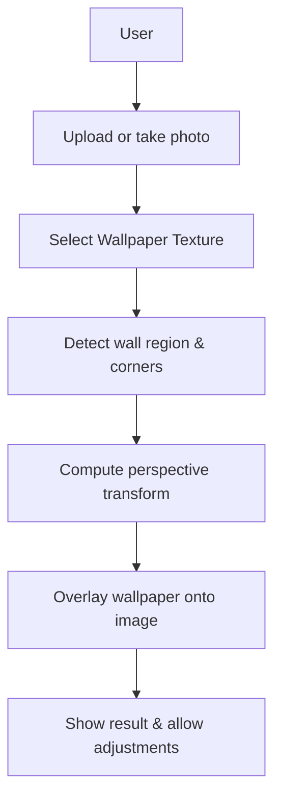
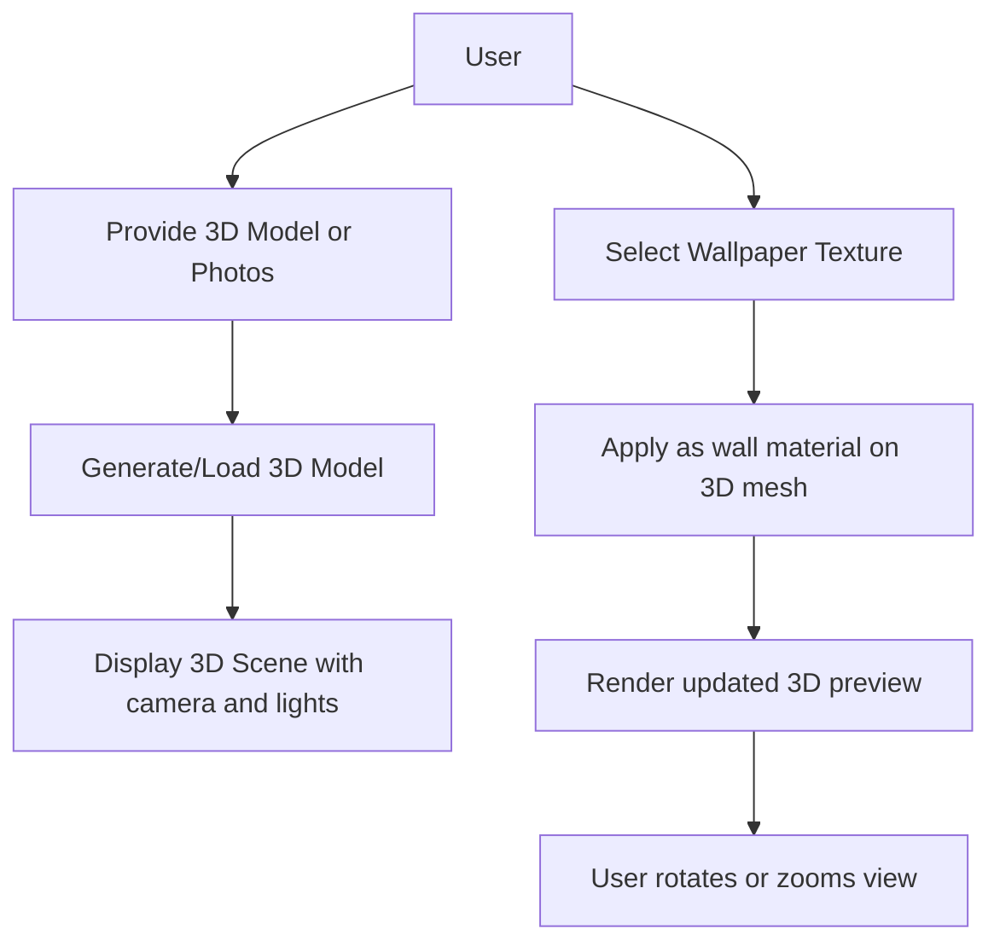
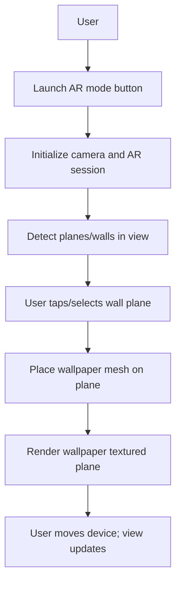

# Executive Summary  
This report surveys and plans React-based implementations for three wallpaper-visualisation solutions, increasing in complexity: **(A) Photo-based 2D overlay**, **(B) 3D-model-based preview**, and **(C) Real-time AR camera overlay**. We begin by clarifying the requirements and research questions, then analyse each solution in depth. For each, we cover goals, user flows, inputs, computer vision (CV) or AR techniques, data formats, preprocessing, UI/UX, performance, accessibility, privacy, testing, deployment, and development complexity. We recommend concrete React architecture patterns (components, state management, hooks/context, routing) and show code snippets for critical tasks. We compare relevant libraries and tools (OpenCV.js, TensorFlow.js, Three.js, Babylon.js, AR.js, WebXR, ModelViewer, GLTF formats, photogrammetry tools, cloud services) in a table along criteria like accuracy, performance, browser/mobile support, licensing, and integration ease. For 3D model generation we discuss photogrammetry pipelines (open-source and cloud services) and ML-based single-image reconstruction, with trade-offs. For real-time AR we compare WebXR, WebAR (AR.js, A-Frame), and native ARKit/ARCore (via React Native frameworks like ViroReact), focusing on hit-testing, plane detection, occlusion, lighting estimation, and texture mapping. Diagrams illustrate user flows (mermaid flowchart) and system architecture. The report concludes with a recommended MVP roadmap, milestones, and estimated effort.

# Problem Statement and Research Questions  
We are building a web application (React-based, no specific browser or OS constraints) that allows users to visualise wallcoverings (wallpaper, paint, etc) in progressively advanced ways: 
- **(A) 2D Overlay:** The user provides or takes a photo of a wall, and the app overlays the chosen wallpaper texture onto the wall in that photo.  
- **(B) 3D Preview:** A 3D model of the room (or wall) is generated or provided, and the user can apply wallpaper textures to the 3D surface and view it from different angles.  
- **(C) Real-time AR:** The user points their device camera at a wall and sees the wallpaper projected in real-time onto the detected surface, adjusting for viewpoint and environment lighting.  

**Research questions:** How can each solution be implemented in React (web or React Native) using current CV/AR techniques? What are the goals, inputs, algorithms, and UX flow for each? What data formats and preprocessing are needed? What libraries and frameworks are suitable (e.g. OpenCV.js, TensorFlow.js, Three.js, Babylon.js, AR.js, WebXR, <model-viewer>, GLTF)? How do we compare these tools on accuracy, performance, support, and ease of use? For 3D model generation, what photogrammetry pipelines or ML methods exist, and what trade-offs do they involve? For AR, how do WebXR, WebAR (marker-based or location-based AR in browser) and native AR (ARKit/ARCore with React Native) compare, especially for plane detection, hit-testing, occlusion and lighting? Finally, what is an appropriate React architecture (components, state, routing) and development plan (MVP milestones and time estimates) to build these features?

# Solution A: Photo-Based 2D Overlay  
### Goals  
- Allow a user to upload or take a photo of a wall or room.  
- Detect the wall region in the photo and apply a perspective transform so that a wallpaper image “sticks” naturally onto that wall.  
- Blend the wallpaper texture seamlessly with the photo (color adjustment, lighting, no harsh edges) to look realistic.  
- Keep the UI simple: upload/select photo, choose wallpaper, align or adjust if needed, and view the result.  

### User Flow (mermaid)  


1. **User selects or captures an image** (via file upload or camera API).  
2. **User selects a wallpaper texture** from a gallery or uploader.  
3. **System detects the wall region**: e.g. using edge detection, segmentation, or manual corner selection.  
4. **Compute perspective mapping**: derive the homography so the flat wallpaper image can be warped to match the wall’s plane in the photo.  
5. **Overlay and blend**: apply the warped wallpaper onto the photo, adjusting colors/lighting if needed to avoid seams.  
6. **Preview and adjust**: user can fine-tune alignment (drag corners) or cancel.  

### Required Inputs  
- **Photo input:** a camera image or uploaded image. Must have metadata or be processed to identify the wall plane.  
- **Wallpaper image:** a texture image (JPEG/PNG) to overlay. Could be user-chosen or preloaded.  
- (Optional) **User annotations:** e.g. if automatic wall detection fails, allow the user to click four corners of the wall.  

### CV Algorithms and Libraries  
- **Wall/plane detection:** Methods include classical CV (edge detection + Hough transform for dominant lines, vanishing point estimation) or **semantic segmentation** (deep models) to find the wall region. Libraries: OpenCV.js for edge/Hough, or TensorFlow.js (or ONNX.js) with a segmentation model (e.g. a lightweight U-Net) to label wall vs non-wall pixels.  
- **Perspective transform:** Compute homography via correspondences (OpenCV’s `getPerspectiveTransform`) and apply it (OpenCV’s `warpPerspective`). In JS: OpenCV.js has `cv.getPerspectiveTransform(srcPts, dstPts)` and `cv.warpPerspective(src, dst, M, size)` to map the wallpaper into the photo’s plane.  
- **Image blending:** Simple alpha blending may suffice, but for seamless results **Poisson blending** or **feathering** can remove visible seams. Poisson image editing adjusts pixel gradients for seamless clones. OpenCV provides `seamlessClone()` (see Poisson blending tutorials). TensorFlow.js could also apply filters or learned color correction.  

### Data Formats  
- **Input photos:** JPEG/PNG (will be read into an HTML `` or `<canvas>`).  
- **Wallpaper textures:** JPEG/PNG (as `` or texture).  
- **Intermediate data:** Points or masks (arrays of coordinates or binary masks).  
- **Output image:** Render onto an HTML5 canvas or save as PNG.  

### Preprocessing Steps  
- **Resize images:** For performance, downscale large photos to a reasonable maximum (e.g. 1024px width) while keeping ratio.  
- **Color/lighting normalization:** If using blending, match color histograms or lighting conditions of wallpaper to photo.  
- **Mask generation:** If segmentation is used, produce a binary mask of the wall region (e.g. via a CNN or GrabCut) to restrict where wallpaper is applied.  

### UI/UX Considerations  
- Provide immediate feedback (loading spinner) while processing (CV tasks can be intensive).  
- Allow manual override: e.g. if wall detection fails, let user drag corners/click to define the wall plane. (This is common in many “paint visualiser” apps.)  
- Show the photo with the wallpaper overlay in real-time (canvas), and an opacity slider to compare with/without wallpaper.  
- Controls: options to flip/scale wallpaper, adjust brightness to match lighting, undo/redo.  
- On mobile, ensure touch-friendly controls (pinch-to-zoom on photo, tap to set corners).  

### Performance Constraints  
- CV in the browser (OpenCV.js, TensorFlow.js) can be CPU-heavy. We should process at low resolution or in a Web Worker to avoid blocking UI.  
- Achieve reasonable speed on typical devices (e.g. <500ms for detection+transform if possible).  
- Use hardware acceleration where possible (WebGL for TensorFlow.js, WASM for OpenCV).  
- Limit image sizes; progressively refine.  

### Accessibility  
- Provide alt text for images and canvases (e.g. “Photo of living room wall with wallpaper pattern overlay”).  
- Keyboard navigation for UI controls (file selector, wallpaper choices).  
- Color contrast in UI elements.  
- For colorblind users, ensure a textual description of results is possible (e.g. metadata “wallpaper A applied” read out).  
- Responsive design to work on different screen sizes.  

### Privacy/Security  
- Process images *client-side* where possible (OpenCV.js/TensorFlow.js run in-browser) to avoid uploading private photos. If a server is used for processing, ensure HTTPS and secure handling.  
- Canvas/WebGL should have `preserveDrawingBuffer` disabled (performance) and output images from UI only upon user action.  
- If using camera (`getUserMedia`) for capturing photo, ensure we handle permission and only use video for capturing, not streaming anywhere.  
- Sanitize any file input to avoid execution of embedded scripts (though images won’t contain code).  
- If storing any user selections (e.g. wallpapers), consider data deletion policies.  

### Testing Strategy  
- **Unit tests:** For non-visual logic (calculating homography matrix, state management).  
- **Integration tests:** Using Cypress or Jest Puppeteer to simulate user flows: upload photo, select wallpaper, see overlay. Use known test images to verify correct corner mapping.  
- **Visual regression tests:** Compare canvas output for known images with expected overlays (using tools like ImageSnapshot).  
- **Cross-browser tests:** Ensure functionality on Chrome, Firefox, Safari, Edge, on desktop and mobile. Test Safari’s WebAssembly support (OpenCV.js requires WASM).  
- **Performance tests:** Benchmark on older devices, measure processing time.  
- **Accessibility tests:** Tools like axe or Lighthouse to check alt texts and keyboard nav.  

### Deployment and Hosting  
- A static single-page app (SPA) can serve this feature (e.g. bundled via Webpack/Create React App). Host on any CDN: Vercel, Netlify, GitHub Pages, AWS S3+CloudFront.  
- If heavy processing, a backend (Node.js with OpenCV) could do more advanced tasks, but initially client-side is safest for privacy.  
- Use HTTPS (needed for `getUserMedia`).  
- Consider packaging as a PWA for mobile (so camera can be accessed and app is installable).  

### Estimated Effort/Complexity  
This 2D-overlay solution is **moderate complexity**. Core CV (perspective transform) is well-understood; OpenCV.js simplifies it. Semantic segmentation of walls is harder but optional (user can override). Blending adds complexity if done seamlessly. Estimated effort: **3–4 developer-weeks** for a basic version (photo upload, 4-corner perspective, simple overlay), and perhaps **2 more weeks** for advanced features (auto-segmentation, blending, UI polish).  

### React Architecture (2D Overlay)  
- **Components:** A `PhotoOverlay` page/component. Inside it:  
  - `PhotoInput` (handles upload or camera capture via `<input type=file>` or `<video>` + canvas).  
  - `WallpaperSelector` (list or gallery component for choosing wallpaper).  
  - `CanvasViewer` (renders the photo and overlay on an HTML5 `<canvas>`).  
  - `CornerEditor` (renders draggable corner handles on the canvas if manual adjustment is needed).  
  - `Controls` (buttons/sliders for opacity, blending mode).  
- **State Management:** Likely `useState` or Context for: the original photo image, wallpaper image, and detected/final corner points. Global state manager (Redux) probably not needed if encapsulated in one page.  
- **Hooks:**  
  - `useEffect` to run CV processing whenever the photo or wallpaper changes.  
  - `useRef` for the canvas DOM element.  
  - Custom hooks like `useOpenCV` to load OpenCV.js asynchronously.  
- **Context:** could use a `WallpaperContext` if managing wallpapers across the app, but for this feature local state is fine.  
- **Routing:** If this is one page of a multi-step app, use React Router: e.g. `/overlay` for this solution.  

### Code Snippet (Warping in OpenCV.js)  
```jsx
// Pseudocode using OpenCV.js for perspective warping
function applyPerspectiveWarp(srcCanvas, dstCanvas, srcCorners, dstCorners) {
  // srcCorners & dstCorners: Float32 arrays [x1,y1,...,x4,y4]
  let srcMat = cv.matFromImageData(srcCanvas.getContext('2d').getImageData(...));
  let dstMat = new cv.Mat();
  let M = cv.getPerspectiveTransform(
    cv.matFromArray(4,1,cv.CV_32FC2, srcCorners),
    cv.matFromArray(4,1,cv.CV_32FC2, dstCorners)
  );
  cv.warpPerspective(srcMat, dstMat, M, new cv.Size(dstCanvas.width, dstCanvas.height));
  cv.imshow(dstCanvas, dstMat); // render result to canvas
  srcMat.delete(); dstMat.delete(); M.delete();
}
// Usage: compute srcCorners from detected photo-wall corners (image coords),
// set dstCorners to [0,0, W,0, 0,H, W,H] to map wallpaper image onto wall plane.
```
This shows how an OpenCV perspective transform can map one image (wallpaper) onto another (photo). In practice, detection yields the four `srcCorners`.

# Solution B: 3D-Model-Based Preview  
### Goals  
- Generate or import a **3D model** of the room or wall to give a realistic preview.  
- Allow the user to **apply wallpaper textures to the model’s walls** and see the result under simulated lighting.  
- Provide interactive controls to **orbit/zoom** around the model, so the user can view the wallpaper in perspective.  
- The experience should convey depth and lighting (shadows) to help visualisation.  

### User Flow (mermaid)  


1. **Acquire 3D model:** user can upload a model (e.g. glTF) or supply photos to be converted.  
2. **(Optional) Photogrammetry:** if photos, generate the model via a pipeline (could be offline/cloud).  
3. **Render 3D scene:** use Three.js/Babylon/<model-viewer> to display the model in the browser.  
4. **User picks wallpaper:** choose image to apply.  
5. **Apply texture:** map the wallpaper image as a texture on the wall mesh’s material.  
6. **Interactive view:** user rotates or zooms the 3D view to inspect.  

### Required Inputs  
- **3D model of room:** format such as glTF (.glb) or OBJ. Can come from photogrammetry or pre-made.  
- **Wallpaper texture:** similar to (A), JPEG/PNG.  
- (Optional) **Wall geometry:** if only wall is modelled (e.g. a flat plane with walls extruded).  

### CV/3D Algorithms and Libraries  
- **3D Engine:** Use a WebGL library. Common choices: **Three.js** or **Babylon.js** (both open-source, cross-platform). We can also use Google’s `<model-viewer>` web component for a simpler integration.  
  - *Three.js* is lightweight and easy to integrate with React (via react-three-fiber). It provides geometry, materials, lights, camera, controls out-of-the-box.  
  - *Babylon.js* is a full-featured 3D engine (physics, PBR, GUI, scene graph) that supports advanced rendering and is also open-source.  
  - **Comparison:** Three.js requires manual setup (camera, lights), while Babylon has built-in engines for physics/animation. Both support WebXR and GLTF models. Three.js has broader community usage, Babylon has rich editor support.  

- **Loading 3D models:** GLTF is the modern standard for efficient 3D assets (binary .glb or JSON .gltf). Use Three.js’s GLTFLoader or Babylon’s equivalent.  
- **Texture mapping:** Once model is loaded, find the mesh(es) representing walls and set their material’s `map` to the wallpaper texture (e.g. `new THREE.TextureLoader().load('wallpaper.jpg')` on the wall mesh’s material). Alternatively, modify UV coordinates to tile/scale the texture.  
- **Photogrammetry:** If user provides photos instead of a model, use a pipeline (see below) to reconstruct. After obtaining a mesh or point-cloud, convert to a format for Three.js.  
- **Lighting:** Use Three.js `DirectionalLight`, `AmbientLight`, or Babylon’s PBR lighting to simulate realistic shading. We may load an HDR environment map for reflections (e.g. using Three.js’s RGBELoader).  

### Data Formats  
- **3D Models:** glTF/GLB (preferred, runs in browser); OBJ/FBX (older, can convert to glTF).  
- **Textures:** JPEG/PNG for wallpaper, plus possible normal maps (optional for bump).  
- **3D images:** If photogrammetry, input images (JPEG) are used by the pipeline (not in the client app).  

### Preprocessing Steps  
- **Model Simplification:** For web performance, ensure the 3D model is optimized (low-poly or decimated, use Draco compression for GLB).  
- **Generate UVs:** The model must have proper UV mapping for walls so textures tile correctly. If importing raw mesh, use a tool (Blender, mesh processing) to unwrap walls.  
- **Texture preparation:** Downscale wallpaper images or generate mipmaps for smoother rendering.  
- **Photogrammetry (if used):** Align and generate mesh from photos (see 3D generation below). This is usually offline or on a server.  

### UI/UX Considerations  
- Provide orbit controls (click-drag to rotate, scroll to zoom) for the 3D view. Use libraries like `OrbitControls` in Three.js (or `<model-viewer>` includes camera-controls).  
- Allow multiple camera presets (e.g. front/side/top view) to inspect the wallpaper from different angles.  
- Show/hide side panels for texture selection. If the model is empty/untextured initially, clearly prompt user to apply wallpaper.  
- If loading time is non-trivial, show a loading spinner or progress (e.g. model assets loading).  
- Consider a “reset view” button.  
- If the user can recolour walls (e.g. a plain color instead of wallpaper), include simple color picker.  

### Performance Constraints  
- 3D rendering is GPU-intensive, so keep scene complexity moderate. Target >30FPS interactive.  
- Use level-of-detail or on-demand loading if model is very large. Draco-compressed GLB helps reduce download size.  
- Test on mobile GPUs – simplify geometry if needed.  
- Batch texture operations to avoid stalling render loop (e.g. use `TextureLoader` with callbacks).  
- Keep the React frame rate separate from Three.js rendering to avoid jank. React-three-fiber manages this automatically.  

### Accessibility  
- Provide fallback content if WebGL is not available (e.g. a static image saying “3D preview requires modern browser”).  
- Ensure any 3D content has an **aria-label** or descriptive caption. For example, wrap the canvas with `<figure><figcaption>3D room preview with wallpaper</figcaption></figure>`.  
- Keyboard navigation: allow arrows to orbit or zoom (via `KeyboardControls` or custom handling).  
- Screen-readers: describe the controls (“Canvas showing 3D model, use mouse or touch to rotate and zoom”).  
- Colorblindness: if showing painted wallpaper, allow switching to high-contrast outline mode.  

### Privacy/Security  
- If using an off-browser service (e.g. cloud photogrammetry), ensure user permission and data protection. But ideally, 3D generation is offline or client-side.  
- No sensitive data processing except the images/models the user provides for visualization.  
- Ensure downloaded 3D assets are sanitized (glTF is JSON/binary; use trusted loaders to avoid code injection).  

### Testing Strategy  
- **Unit tests:** e.g. test that a selected texture URL is correctly applied to a wall mesh’s material.  
- **Integration:** Automated tests with frameworks like Cypress on a headless browser may be difficult for WebGL, but we can snapshot known scenes using something like `jest-canvas-snapshot`.  
- **Visual checks:** Ensure textures appear on all walls (no upside-down UVs).  
- **Cross-platform:** Test on Chrome, Safari, Firefox; on Android and iOS browsers (mobile Safari supports WebGL; ARKit not in browser for AR but 3D still works).  
- **Performance tests:** Use tools like three.js Inspector or built-in stats to check FPS.  
- **Model compatibility:** Load several sample glTF models (different creators) to verify loader handling.  

### Deployment and Hosting  
- The 3D assets (models, textures) can be hosted as static files (on the same server or CDN). React app bundle plus assets on Vercel/Netlify/AWS.  
- Consider a CDN with large bandwidth if models are big.  
- No special runtime beyond browser; `<model-viewer>` or Three.js run in static context.  
- If using React Native (below), then different (app stores). But for web, static hosting suffices.  

### Estimated Effort/Complexity  
This is **high complexity**. Creating or obtaining a 3D model (especially by photogrammetry) is time-consuming. The 3D view and texture mapping require knowledge of Three.js or Babylon and UV mapping. An MVP (with a pre-made simple room model) might take **4–6 weeks**: building the React three-fiber components, loading a model, applying textures, and basic orbit controls. Adding photogrammetry support or complex UV editing might be another **4–6 weeks**.  

### React Architecture (3D Preview)  
- **Components:**  
  - `RoomPreview` page: wraps all 3D logic.  
  - Within it, a `Canvas` component (from `@react-three/fiber`) for WebGL.  
  - `GLTFModel` subcomponent: uses `useLoader(GLTFLoader, url)` to load the room model and adds it to the scene.  
  - `WallpaperMaterial`: a React component or hook that loads a texture (`useLoader(TextureLoader, url)`) and applies it to selected wall meshes (by name or ID).  
  - `Lighting` component: sets up lights (e.g. `<ambientLight>` and `<directionalLight>`).  
  - `Controls`: UI for wallpaper selection and view manipulation.  
- **State Management:** Use `useState` for chosen wallpaper texture URL. Pass this as prop to `WallpaperMaterial` to update mesh materials when changed. Global context not strictly needed.  
- **Hooks:**  
  - `useLoader` (from drei) to load GLTF and textures.  
  - `useFrame` (react-three-fiber) for animations (if any).  
  - Possibly `useMemo` to reuse textures/materials.  
- **Context:** If wallpapers are global across app, a `WallpaperContext` could hold available textures. But could also be local to this page.  
- **Routing:** Possibly `/preview` route.  

### Code Snippets  
```jsx
// Example using react-three-fiber and drei for 3D model and texture
import { Canvas } from '@react-three/fiber';
import { useGLTF, useTexture, OrbitControls } from '@react-three/drei';

// Component to load and render the room model
function RoomModel({ wallpaperUrl }) {
  const gltf = useGLTF('/models/room.glb');
  const texture = useTexture(wallpaperUrl);
  // Assume the wall mesh is named "Wall01" in the GLTF
  let wallMesh = gltf.scene.getObjectByName('Wall01');
  if (wallMesh) {
    wallMesh.material = new THREE.MeshStandardMaterial({ map: texture });
  }
  return <primitive object={gltf.scene} />;
}

// In App component:
function App() {
  const [wallpaper, setWallpaper] = useState('/textures/pattern1.jpg');
  return (
    <>
      <ControlsPanel onChange={url => setWallpaper(url)} />
      <Canvas camera={{ position: [0,5,10], fov: 50 }}>
        <ambientLight intensity={0.5} />
        <directionalLight intensity={0.8} position={[10,10,10]} />
        <RoomModel wallpaperUrl={wallpaper} />
        <OrbitControls />
      </Canvas>
    </>
  );
}
```
This shows loading a GLTF model and applying a wallpaper texture to one mesh. Using React’s hooks and components (via react-three-fiber) integrates Three.js into React code.  

Alternatively, one could use Google’s `<model-viewer>` component:  

```html
<model-viewer src="room.glb" 
              alt="3D room model" 
              ar ar-modes="scene-viewer webxr" 
              auto-rotate camera-controls>
  <!-- Wallpaper textures can be swapped by setting material properties via JS -->
</model-viewer>
```
The `<model-viewer>` element automatically handles a 3D viewer and AR button on supported devices. It supports GLTF models out-of-the-box and can transition to AR using WebXR or Scene Viewer on Android. In React you can use `react-model-viewer` or insert `<model-viewer>` directly.

# Solution C: Real-Time AR Camera Overlay  
### Goals  
- **Overlay wallpaper in the real world**: The app uses the device camera feed to display the live wall, and renders the selected wallpaper aligned with the physical wall in real-time.  
- **Interactive AR:** As the user moves or rotates the device, the wallpaper stays “glued” to the wall with correct perspective, scale, and occlusion (virtual wallpaper should appear behind real objects if needed).  
- **Lighting and realism:** Use environment information (light estimation) so the wallpaper’s brightness matches the scene.  
- **Cross-platform:** Prefer a web-based AR if possible; otherwise consider a React Native app using ARCore/ARKit for richer features.  

### User Flow (mermaid)  


1. **User enters AR mode:** clicks an “AR Preview” button. The app requests camera and AR permissions.  
2. **Initialize AR session:** start WebXR or native AR session, with feature requests like plane detection and lighting estimation.  
3. **Detect plane:** the AR system finds flat surfaces (vertical wall) via sensors (depth, motion) or user tap gestures.  
4. **Place wallpaper:** project a rectangular mesh textured with the wallpaper onto the detected plane (scaled to real-world measurements).  
5. **Render with occlusion/lighting:** as device moves, continuously update the pose of the virtual wallpaper so it stays aligned. Use depth sensing or geometry for occlusion (e.g. if a chair partially blocks the wall, the wallpaper should not render over the chair). Adjust brightness if lighting changes.  
6. **User interacts:** option to move wallpaper to other walls, adjust orientation, etc.  

### Required Inputs  
- **Camera feed:** real-time video from device rear camera (accessed via WebXR or `getUserMedia`).  
- **Wallpaper texture:** the image selected by user (as in A and B).  
- (Optional) **Plane dimensions:** some AR systems allow specifying physical size or using hit-test to set real-world scale.  

### CV/AR Algorithms and Libraries  
- **AR frameworks:**  
  - **WebXR (W3C standard):** Provides AR session (if browser supports it). Features include plane detection, hit-testing, anchors, depth, light estimation. In JavaScript, one uses `navigator.xr.requestSession('immersive-ar', ...)` to start. Three.js’s `ARButton` (or @react-three/xr) can help.  
  - **WebAR (markerless libraries):** AR.js (via A-Frame or direct Three.js) can track markers or location-based AR. However, AR.js (pure JS) historically needs markers or separate location data – it has limited plane detection (mostly image/marker tracking).  
  - **8th Wall (commercial):** A robust WebAR platform (proprietary) supporting SLAM and plane detection on almost any mobile browser. Not open-source, so costly licensing.  
  - **React Native AR:** Using ViroReact or `react-native-arkit` to access native ARKit/ARCore. This runs on-device for iOS/Android and supports advanced features (horizontal/vertical planes, hit-test, environment lighting, occlusion). Example: ViroReact’s `<ViroARPlaneSelector>` and `<ViroImage>` for placing textures.  

- **Hit-testing:** Maps a screen point (e.g. user tap) to a real-world point on a detected surface. WebXR provides `XRHitTestSource` for this. ARKit/ARCore have equivalent APIs. This lets the user tap the wall to anchor the wallpaper plane.  
- **Plane detection:** ARKit/ARCore automatically detect surfaces (horizontal/vertical). WebXR plane detection is emerging (Immersive Web PR for plane detection). AR.js has no true plane detection (needs markers).  
- **Lighting estimation:** ARCore’s Lighting Estimation API gives ambient intensity, main light direction, and even HDR cubemaps. ARKit similarly provides ambient intensity and color. WebXR has a `lighting-estimation` module. We use this to adjust the wallpaper’s material brightness/contrast so it matches scene lighting.  
- **Occlusion:** Use depth data to occlude virtual objects behind real ones. WebXR’s Depth Sensing API (e.g. `depth-sensing` feature) provides a depth texture. ARKit/ARCore can also estimate geometry to some degree. Our solution would use the AR framework’s occlusion feature: for WebXR, use `depth-sensing`; for ARKit, use `ARKit`’s object occlusion or Semantic segmentation.  
- **Texture mapping:** The wallpaper image is applied to a 3D plane (mesh) that is placed flush with the detected wall. We must compute the plane’s real-world width/height (via hit-test or user guidance) and then texture it with the image, repeating or scaling as needed.  

### Data Formats  
- **AR session data:** Live video frames (not stored).  
- **Anchors/planes:** XR anchors (immutable references to detected surfaces), no raw data needed unless doing custom processing.  
- **Wallpaper:** Same image formats (JPEG/PNG).  

### Preprocessing Steps  
- **Prepare wallpaper for rendering:** create a GPU texture, perhaps generating mipmaps for AR mode.  
- **Calibration:** If precise scale is needed, allow user to input or confirm wall dimensions (or assume 1 meter = 1 unit if AR reports size).  
- **Model conversion:** If using a React Native solution (see below), ensure the wallpaper is packaged as a resource or asset that the AR module can load.  

### UI/UX Considerations  
- Guide the user: show on-screen instructions (“Move camera to scan room” or “Tap to place wallpaper”) because AR has a learning curve.  
- Provide feedback during tracking: visual reticles or highlighted planes where the system detects surfaces.  
- AR-only controls: Use mobile-friendly UI overlays (buttons for “take snapshot”, “change wallpaper”, “exit AR”). Ensure they don’t obstruct view.  
- Exit AR clearly (an “X” button). On iOS Safari/WebXR, the AR session’s “DONE” UI appears automatically, but we may need a fallback for other platforms.  
- For devices/browsers without WebXR, provide a graceful fallback: e.g. a message “AR not supported on this device”.  

### Performance Constraints  
- **Frame rate:** Must render at least ~30fps for smooth AR; ideally 60fps on capable devices. Use requestAnimationFrame via the AR framework.  
- **Latency:** Camera feed → rendering loop is sensitive; use minimal JS overhead. Three.js/WebXR does most of this in native code.  
- **Resource usage:** AR on mobile can drain battery/GPU. Use small meshes (a flat plane is trivial).  
- **Feature detection:** Check support (e.g. `navigator.xr.isSessionSupported('immersive-ar')`) and enable only available features to avoid failures.  

### Accessibility  
- AR is inherently visual, but try to accommodate:  
  - Provide an alternate caption or summary for screen-readers (e.g. “AR mode showing wallpaper on wall”).  
  - If we allow placing the wallpaper by voice or gesture, that’s complex. Probably not needed in MVP.  
  - Controls like “change wallpaper” should be accessible (ARIA labels, focusable).  

### Privacy/Security  
- AR uses camera: must prompt permission (browser handles this). State explicitly that the camera feed is used only for AR preview and is not recorded or sent anywhere.  
- Ensure HTTPS (required for WebXR `requestSession` and `getUserMedia`).  
- On React Native, follow App Store/Play Store camera privacy guidelines (add usage descriptions to Info.plist/AndroidManifest).  
- No user data is transmitted unless using a cloud AR service (which we would avoid in a basic implementation).  

### Testing Strategy  
- **Functional tests:** Hard to automate AR. Manual testing on devices (Android with Chrome, iOS with Safari or custom RN app) is needed.  
- **Sanity checks:** For WebXR, use the WebXR emulator or testing frameworks, though limited.  
- **Cross-device:** Test on several phones/tablets. Check plane detection accuracy (vertical vs horizontal).  
- **Hot corners:** Try placing on known vertical surface (wall), not on an arbitrary angle.  
- **Error conditions:** Test denial of camera permission, unsupported browser.  

### Deployment and Hosting  
- **WebXR/AR.js:** Can be delivered as part of the web app; requires HTTPS.  
- **React Native (ARKit/ARCore):** If chosen, separate build and publish to app stores. Use tools like Expo or direct Xcode/Android Studio.  
- For cross-platform web, note that iOS Safari’s WebXR support is limited; `<model-viewer>` can fallback to Scene Viewer on Android (native). For iOS, one could use a library like “WebXR Polyfill” or simply note limitations.  

### Native vs Web AR Options  
- **WebXR (React web):** Good for Chrome/Edge on Android (ARCore). Limited on iOS (Safari has no WebXR; iOS 14+ supports WebAR Quick Look via USDZ but not full WebXR).  
- **AR.js:** Works on any WebGL-capable mobile, but only marker/location AR, not plane detection. Useful if no WebXR, but requires marker (not ideal for wallpaper on walls).  
- **<model-viewer>:** Automatically handles ARCore on Android (WebXR or Scene Viewer) and Quick Look on iOS (as Scene Viewer). Easiest for simple placement (one tap AR). However, <model-viewer> AR is for showing models in AR, not arbitrary texture placement on real walls. It would show a virtual model with wallpaper, not the real wall.  
- **React Native (ViroReact or React Native ARKit):** Full-featured and cross-platform (iOS+Android). Provides reliable plane detection, hit-testing, anchors, and environment lighting. Example:  
  ```jsx
  <ViroARScene>
    <ViroARPlaneSelector onPlaneDetected={setPlane}>
      <ViroBox materials={["wallpaperMat"]} height={2.5} width={3} length={0.01} />
    </ViroARPlaneSelector>
  </ViroARScene>
  ```  
  With a `wallpaperMat` material using the image as texture. Viro handles ARKit/ARCore under the hood. This approach yields the best AR quality but requires native deployment.  

### Example Code Snippet (WebXR + Three.js)  
```js
// Basic WebXR AR session setup with Three.js (not React-specific)
if (navigator.xr) {
  navigator.xr.requestSession('immersive-ar', { 
    requiredFeatures: ['hit-test', 'light-estimation'] 
  }).then((session) => {
    renderer.xr.setSession(session);
    // Setup AR scene ...
    const xrRefSpace = await session.requestReferenceSpace('local');
    const viewerRefSpace = await session.requestReferenceSpace('viewer');
    const hitTestSource = await session.requestHitTestSource({ space: viewerRefSpace });
    session.addEventListener('select', (evt) => {
      // On screen tap, do hit test to place wallpaper
    });
    // Render loop will use session.requestAnimationFrame(...)
  });
}
```
This shows requesting an AR session with hit-testing and light estimation. Inside the AR loop, we would update a textured `PlaneGeometry` placed at the hit-test location (wall plane) each frame.

### Libraries Comparison (Libraries/Tools)  

| Library/Tool       | Purpose                             | Accuracy            | Performance        | Browser Support       | Mobile Support         | License     | Ease of Integration     |
|--------------------|-------------------------------------|---------------------|--------------------|-----------------------|------------------------|-------------|-------------------------|
| **OpenCV.js**      | Image processing (CV) in browser    | Very high (classical CV) | Moderate (WASM)   | Modern (WASM-enabled) | Yes (Chrome/Safari)    | BSD-3      | Medium (C++ API in JS)  |
| **TensorFlow.js**  | Machine learning in browser (e.g. segmentation) | High (if model trained) | Heavy (GPU/CPU)    | Modern browsers (WebGL2) | Yes (Chrome, limited Safari) | Apache 2.0 | Medium (need models)   |
| **Three.js**       | 3D rendering engine                 | N/A (graphics lib)  | Good (WebGL)       | All WebGL browsers    | All (WebGL mobile)     | MIT         | Easy (npm, docs)        |
| **Babylon.js**     | 3D engine with full features (physics, GUI, PBR) | N/A             | Good (WebGL)       | All WebGL browsers    | All (WebGL mobile)     | Apache 2.0  | Medium (more features)  |
| **AR.js**          | WebAR (marker/image-based AR)       | Good for markers    | Fast (JS optimized)| All WebGL phones      | Yes (Chrome/Safari)    | MIT         | Easy (if marker-based)  |
| **WebXR Device API** | Web standard for AR/VR           | N/A (hardware dep.) | High (native)      | Chrome/Edge (Android), experimental Safari (iOS14) | Partial (ARCore on Android, limited iOS) | Open Spec   | Medium (browser APIs) |
| **<model-viewer>** | Web 3D/AR component (Google)        | N/A                 | Good (Three.js under hood) | Evergreen browsers (Chrome, Edge, Firefox) | AR modes on ARCore devices (Android), Quick Look on iOS | Apache 2.0  | Very Easy (HTML tag)    |
| **glTF**           | 3D model file format (Khronos)      | N/A (data format)   | Efficient (binary) | N/A (used by engines) | N/A                   | Open (Khronos) | N/A                   |
| **Photogrammetry Tools** (e.g. Meshroom, OpenDroneMap) | Create 3D model from photos | High (with many images) | Slow (batch process) | N/A                   | N/A (external process)| varies (most OSS) | Hard (image capture needed) |
| **Cloud 3D APIs** (e.g. Agisoft Cloud, Pix4D Cloud) | Automated 3D model generation | High (paid, optimized) | Fast (cloud GPU) | N/A (cloud service)   | N/A                   | Commercial  | Easy (upload images)    |
| **React Three Fiber** | React renderer for Three.js      | N/A                 | As above (WebGL)   | N/A (wrapper)         | N/A                   | MIT         | Easy (React integration) |
| **ViroReact**      | React Native ARKit/ARCore bridge    | High (native AR)    | Very high (native) | Requires iOS/Android native apps | iOS/Android (native) | MIT         | Medium (RN setup)      |

- **Notes:** OpenCV.js (WASM) and TensorFlow.js enable on-device image processing, but TF.js requires model handling. Three.js and Babylon.js are both MIT/Apache and well-supported (Three.js is simplest; Babylon.js is more full-featured). AR.js is free and fast but limited to marker/QR or location AR. WebXR (Immersive Web) is open standard but still not fully in Safari (see MDN). `<model-viewer>` is great for quick 3D preview/AR on ARCore and iOS devices, albeit it’s a web component, not a JS library.  
- **Photogrammetry:** Open-source tools (Meshroom, OpenDroneMap) require many images and offline processing. Commercial services (Agisoft Metashape, Pix4D) offer cloud APIs but cost money. ML “single-image reconstruction” is experimental (results are coarse and limited by scene ambiguity).  

# 3D Model Generation (Photogrammetry & ML)  
For solution (B), we need a 3D model of the room or wall. Options:

- **Photogrammetry (multi-photo):** User takes many overlapping photos around the room. Tools like **Meshroom** (AliceVision) or **OpenMVG/OpenMVS** pipelines can reconstruct a point cloud and mesh. This yields highly accurate, textured models if done properly.  
  - *Pipeline:* capture ~20–50 images from different angles (Polycam advises 20+ with overlap). Then run a Structure-from-Motion (SfM) algorithm to find camera poses and sparse points, then Multi-View Stereo to densify, finally mesh generation and texture baking.  
  - *Complexity:* High effort. Requires batch processing (often on desktop or cloud, taking hours). Results can be 3D model (e.g. glTF) you import into the web app.  
  - *Tools:* Meshroom (GUI), OpenDroneMap (command-line/web UI), commercial (Metashape, RealityCapture).  
  - *Cloud services:* Polycam offers a user-friendly service (via mobile app or web) to capture interiors; Agisoft Cloud, Pix4D Cloud provide APIs.  
  - *Trade-offs:* Highest fidelity vs. time & required skill.  

- **Single-Image or Few-Image 3D:** Emerging ML methods (NeRF, single-image depth estimation) can guess 3D geometry from 1–2 photos, but results are approximate, especially for complex indoor scenes. Not production-ready for accurate previews.  

- **Pragmatic approach:** For MVP, use a **pre-made template model** or ask the user to provide a 3D file (e.g. architects plan or LiDAR scan). Photogrammetry is more of a “future enhancement” due to its complexity.  

# Real-Time AR Frameworks and Comparison  
For solution (C), the choices include:  
- **WebXR (web AR):** The W3C WebXR Device API (with the AR module) is the standard for in-browser AR. It’s implemented in Chrome/Edge on Android (using ARCore). It supports hit-testing, anchors, plane detection (experimental), depth sensing, and light estimation. Benefits: runs in the browser (no install). Drawbacks: not supported on iOS Safari (though Google’s Scene Viewer or WebAR polyfills can help).  
- **WebAR libraries:** AR.js (A-Frame-based) is pure JavaScript and works on any modern phone with WebGL, but it requires markers or location tracking – not true markerless plane tracking. Useful if you target image/marker-based AR (not ideal for wallpaper).  
- **<model-viewer> AR:** Simplest web AR for 3D models: it uses WebXR or Scene Viewer under the hood. However, it only places entire 3D models (not arbitrary wallpaper textures onto real walls), so it’s not a direct solution for wallpaper overlay (more for showing a piece of furniture in AR).  
- **Native AR (React Native):** ViroReact or `react-native-arkit` let a React Native app use ARCore/ARKit directly. These provide robust plane detection, hit-testing, environment textures, etc. E.g. ViroReact’s components let you detect planes and place virtual content with just React components. This yields the best AR fidelity (including shadows, persistent anchors, etc) at the cost of building an app (6th milestone). Licensing is open (MIT) and integrates with React’s state/props.  

**AR Features:**  
- **Hit-Testing:** Converts a screen tap to a 3D point on a detected surface. WebXR’s Hit Test API and ARCore/ARKit hitTest functions accomplish this. We’d use this to let the user tap the wall and anchor the wallpaper there.  
- **Plane Detection:** ARKit/ARCore automatically find flat surfaces (both horizontal and vertical). WebXR’s plane detection is nascent (Immersive Web Exp). AR.js does not have true plane detection.  
- **Occlusion:** WebXR’s Depth Sensing (or ARKit’s Scene Reconstruction) can create a depth map, so virtual objects are occluded by real geometry. ViroReact/ARKit provide simpler “people occlusion” and plane occlusion APIs.  
- **Lighting Estimation:** ARCore’s Lighting API provides ambient and directional light data (main light direction, ambient spherical harmonics, environment map). WebXR has a Lighting Estimation module (part of Immersive AR spec). Use this to match wallpaper brightness.  

**Example AR (React) Snippet (ViroReact):**  
```jsx
// React Native AR (ViroReact) example
import { ViroARScene, ViroARPlaneSelector, ViroNode, ViroImage } from 'react-viro';

function ARScene({ wallpaperUri }) {
  return (
    <ViroARScene>
      <ViroARPlaneSelector onPlaneSelected={({position, rotation}) => { /* record anchor */ }}>
        <ViroNode position={[0,0, -3]}> 
          <ViroImage 
            height={2.5} width={3.5} source={{uri: wallpaperUri}} 
          />
        </ViroNode>
      </ViroARPlaneSelector>
    </ViroARScene>
  );
}
```
This uses ARKit/ARCore under the hood. When a horizontal or vertical plane is detected, `ViroARPlaneSelector` allows tapping to place a `ViroImage` textured with the wallpaper onto that plane.

# Recommendations and MVP Roadmap  

Given scope and complexity, we suggest building iteratively:

1. **MVP (Weeks 1–4):**  
   - Implement **Solution A (2D Overlay)** fully: photo upload, manual corner input, perspective warp and simple overlay (no fancy blending). Use OpenCV.js for transform. Provide basic UI (upload, select wallpaper, see overlay). This is lowest-hanging fruit.  
   - Launch as a web page with routes `/overlay`.  
   - *Milestones:*  
     - Week 1: Setup React project, basic UI for photo and wallpaper input.  
     - Week 2: Integrate OpenCV.js, implement warpPerspective transform.  
     - Week 3: UX polishing (drag corners, opacity slider). Accessibility text.  
     - Week 4: Testing and deployment (e.g. to Netlify).  

2. **Mid-Phase (Weeks 5–10):**  
   - Begin **Solution B (3D Preview)** using a static 3D model. Use React Three Fiber and load a sample glTF of a room. Apply wallpaper textures to wall meshes. Add orbit controls. Host model on CDN.  
   - Meanwhile, integrate an automatic 3D generation plan: e.g. experiment with Polycam or OpenDroneMap for model creation (not immediate user feature, but part of workflow for future).  
   - *Milestones:*  
     - Week 5–6: Integrate Three.js via react-three-fiber; display a simple room model.  
     - Week 7–8: Implement wallpaper texture swapping on walls.  
     - Week 9: UI for model loading and texture selection. Testing on mobile.  
     - Week 10: If time, attempt a basic photogrammetry import (off-line process).  

3. **Advanced Phase (Weeks 11–16):**  
   - Develop **Solution C (Real-Time AR)**. First attempt WebXR in browser: use @react-three/xr or raw Three.js ARButton to start AR session. On ARCore devices (Chrome Android), let user tap to place wallpaper.  
   - If WebXR is unreliable or limited (especially on iOS), plan for React Native AR app: use ViroReact to reuse components from web (textures) and implement AR scene natively.  
   - *Milestones:*  
     - Week 11–12: Prototype WebXR AR on Android. Setup hit-testing and place textured plane.  
     - Week 13–14: Lighting estimation (adjust material). Occlusion if possible (depth). Basic AR UI instructions.  
     - Week 15: Evaluate iOS path. Possibly build a React Native app shell with ViroReact plane placement.  
     - Week 16: Testing on multiple devices, accessibility (e.g. alt text saying “AR on” etc).  

4. **Refinements (Weeks 17–20):**  
   - Improve seamless blending in 2D (e.g. implement Poisson blending or color matching).  
   - Allow photo segmentation: incorporate a TensorFlow.js or ML model to automatically mask walls.  
   - Optimize 3D: Draco compression, dynamic load for models.  
   - Polish AR: fallback messages for unsupported devices, UI refinements.  
   - Prepare final documentation and integration.  

**Rough Time Estimates:**  
- Solution A: ~4 weeks  
- Solution B: ~6 weeks  
- Solution C (WebXR): ~4–6 weeks; (React Native AR as alternative): +3 weeks  
- Testing, deployment, and buffer: ~2–4 weeks  

This yields an MVP in about 10–12 weeks, with advanced AR (native) by week 16 and polish by week 20. These estimates assume an experienced React developer and access to needed assets.

---

> **Note (added during implementation):** This document was supplied by the project owner as an
> additional planning reference. The companion file `wallpaper-visualization-research.md` contains
> the deeper 2026 technology survey (current library versions, WebXR feature support, ML 3D
> reconstruction, ViroReact status). Where this report suggests OpenCV.js for the 2D warp, the
> shipped implementation instead uses a pure-TypeScript homography solver + WebGL2 shader (no WASM
> dependency) — see `src/features/photo-overlay/`. Solution B (this 3D preview) is implemented with
> raw Three.js and a procedural room in `src/features/room-3d/`.
