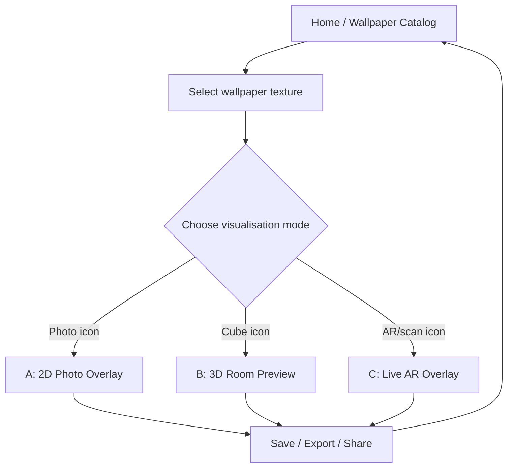
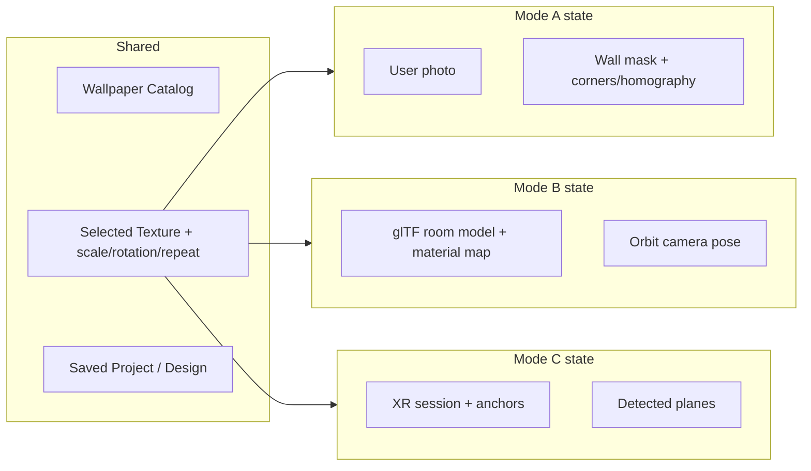
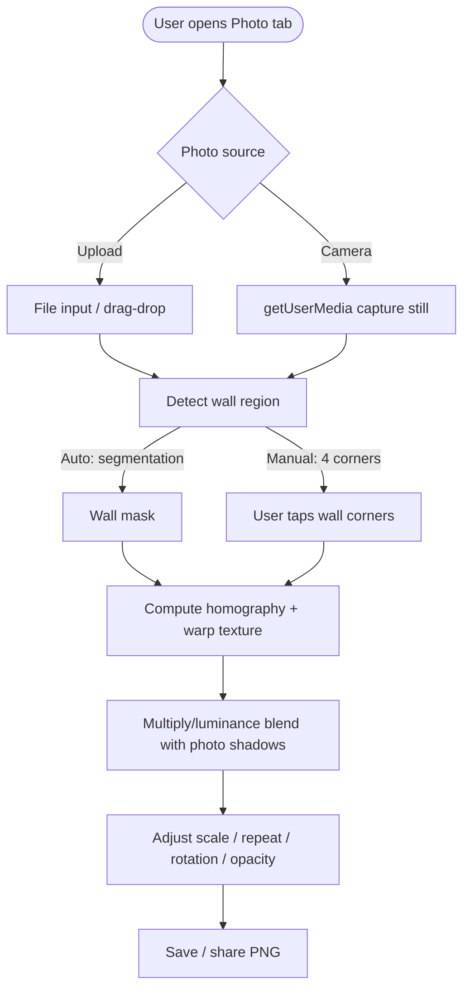
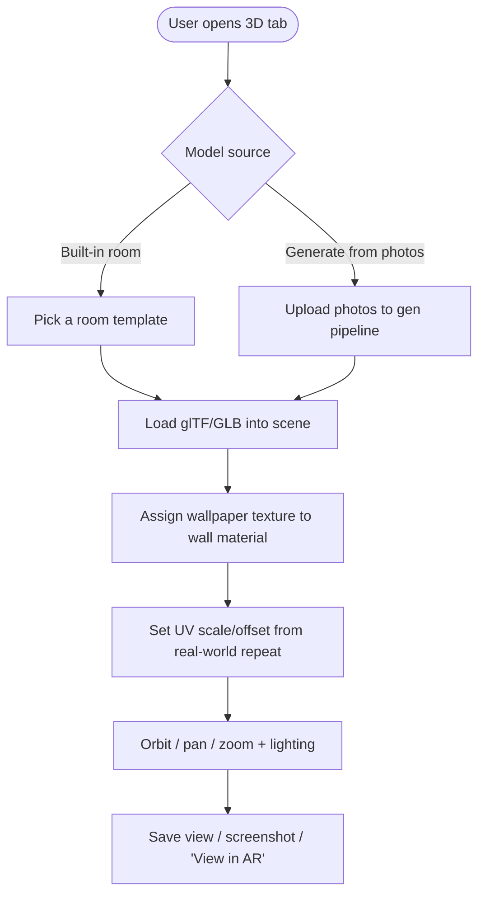
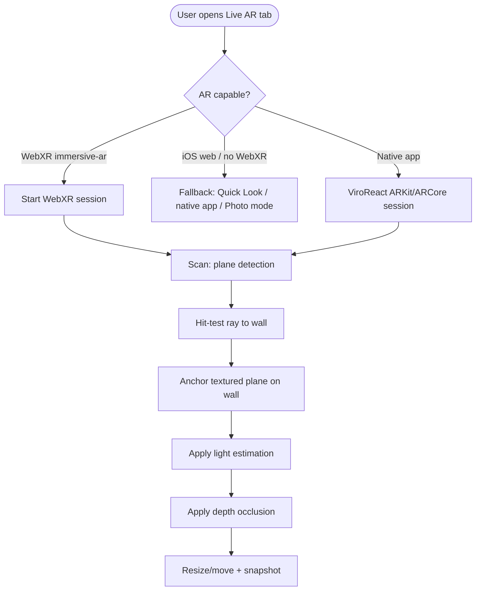
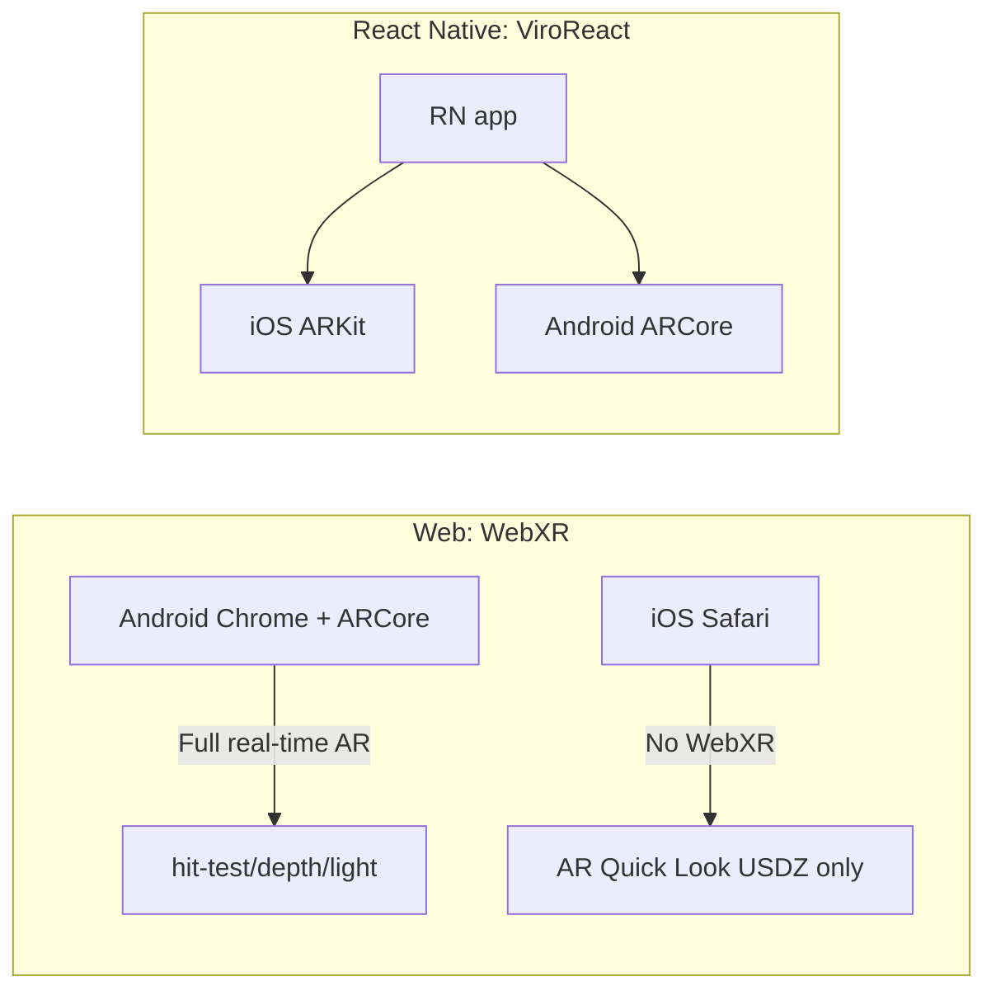
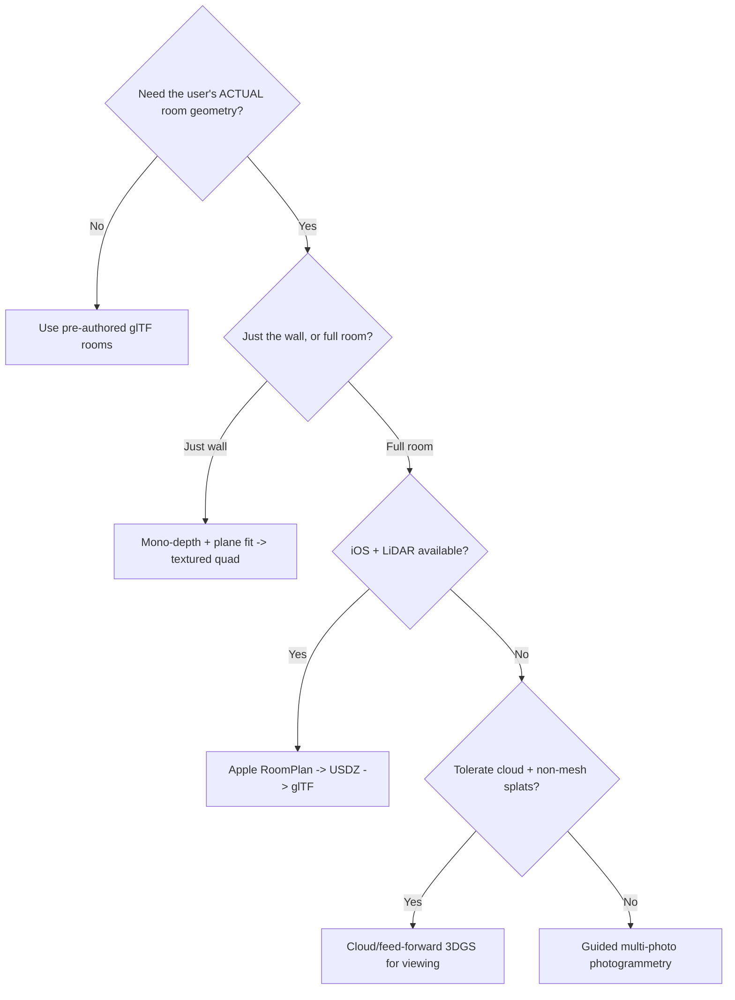
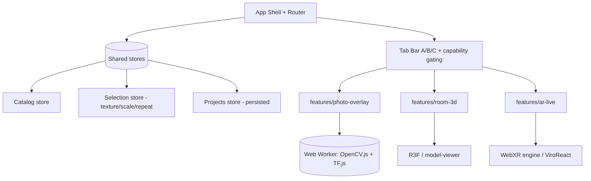
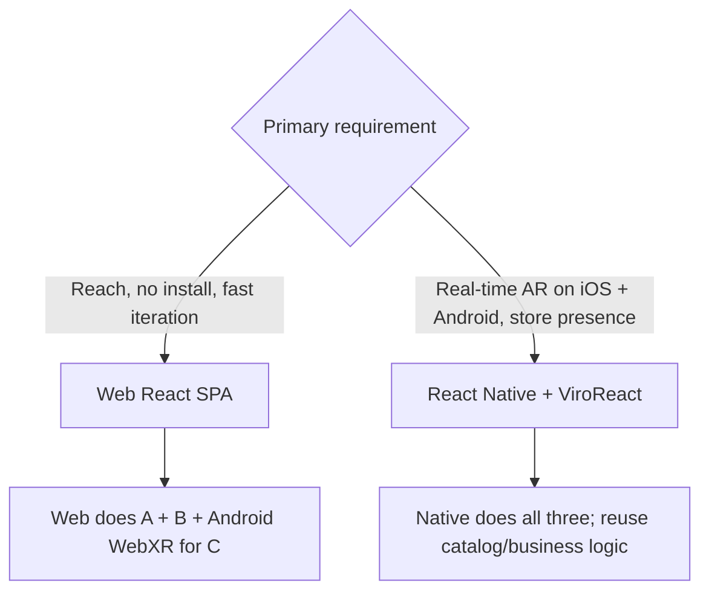

# Wallpaper Visualisation in React: Deep Technical Research & Implementation Plan

> A practitioner-grade survey and build plan for three wallpaper/wallcovering visualisation
> features in a single React app: **(A) 2D Photo Overlay**, **(B) 3D Model Preview**, and
> **(C) Real-time AR Camera Overlay**.
>
> Audience: senior React / React Native / full-stack engineers.
> Currency: technology versions and standards as of **June 2026**.

---

## Table of Contents

1. [Executive Summary & TL;DR Recommendation](#1-executive-summary--tldr-recommendation)
2. [Problem Statement & Research Questions](#2-problem-statement--research-questions)
3. [How the Three Features Live in One App (Tabs + Icons)](#3-how-the-three-features-live-in-one-app-tabs--icons)
4. [Solution A — 2D Photo Overlay](#4-solution-a--2d-photo-overlay)
5. [Solution B — 3D Model Preview](#5-solution-b--3d-model-preview)
6. [Solution C — Real-time AR Camera Overlay](#6-solution-c--real-time-ar-camera-overlay)
7. [Library & Tooling Comparison Tables](#7-library--tooling-comparison-tables)
8. [3D Model Generation: Photogrammetry vs ML Reconstruction](#8-3d-model-generation-photogrammetry-vs-ml-reconstruction)
9. [Cross-Cutting Concerns (Perf, A11y, Privacy, Testing, Deployment)](#9-cross-cutting-concerns)
10. [Recommended React Architecture](#10-recommended-react-architecture)
11. [MVP Roadmap, Milestones & Effort Estimates](#11-mvp-roadmap-milestones--effort-estimates)
12. [Risks, Open Questions & Decisions Needed](#12-risks-open-questions--decisions-needed)
13. [References](#13-references)

---

## 1. Executive Summary & TL;DR Recommendation

You want one app, three increasingly ambitious ways to "see wallpaper on a wall":

| | Feature | Best stack (2026) | Complexity | Ship in MVP? |
|---|---|---|---|---|
| **A** | 2D photo overlay | React + `<canvas>`/WebGL + TensorFlow.js DeepLab (ADE20K wall segmentation) + homography warp via OpenCV.js | Low–Med | ✅ Yes |
| **B** | 3D model preview | React + Three.js (`@react-three/fiber` + `drei`) **or** `<model-viewer>`; glTF/GLB assets, texture/UV remap | Medium | ✅ Yes (with pre-authored room models) |
| **C** | Real-time AR | **Web:** WebXR (`hit-test` + `depth-sensing` + `light-estimation`) via Three.js/Babylon.js. **Native:** React Native + **ViroReact / `@reactvision/react-viro`** (ARKit/ARCore) | High | ⚠️ Phase 2 (web first, native if iOS parity required) |

**Headline recommendations**

- **Build the web app first** with a tabbed shell (A, B, C). A and B are fully achievable in pure web React. C works in web on Android Chrome via WebXR but **iOS Safari has no WebXR AR**, so plan a React Native (ViroReact) path for true cross-platform AR.
- **For A**, the winning combo is *semantic segmentation to find the wall mask* (TensorFlow.js DeepLab `ade20k`, where "wall" is class 0) + *perspective warp of the wallpaper texture* (homography from 4 user-placed corners, computed with OpenCV.js `getPerspectiveTransform`) + *luminance-preserving blend* so the wallpaper inherits the room's shadows/lighting.
- **For B**, don't try to auto-generate rooms on day one. Ship with a small library of **pre-authored glTF room/wall models** and swap textures on named materials. Add ML single-image reconstruction (3D Gaussian Splatting / monocular depth) as an *advanced, async* generation pipeline later.
- **For C**, use **WebXR** for the browser MVP (Android) and graduate to **ViroReact** (now actively maintained by ReactVision, MIT licensed, `@reactvision/react-viro` v2.56.0, Jun 2026) for production-grade iOS+Android AR with native ARKit/ARCore plane detection, occlusion (depth), and light estimation.
- **Privacy first**: do segmentation/warp **on-device** wherever possible. Photos of someone's home are sensitive. Only send images to the cloud for the heavy 3D-generation pipeline, and only with explicit consent.

---

## 2. Problem Statement & Research Questions

We are building a React-based app (web + optional React Native) that lets users preview
wallcoverings (wallpaper, paint, murals, tile) on their own walls in three escalating modes:

- **(A) 2D Overlay** — user supplies/takes a photo of a wall; app overlays the chosen texture onto the wall region, matched to perspective and lighting.
- **(B) 3D Preview** — a 3D model of the wall/room (provided or generated) is textured with the wallpaper and rotated/zoomed.
- **(C) Real-time AR** — user points a live camera at a wall and sees the wallpaper composited onto the detected plane in real time, adjusting for viewpoint and lighting.

**Research questions addressed in this report**

1. How is each solution implemented in React (web or React Native) with current CV/AR techniques?
2. What are the goals, inputs, algorithms and UX for each?
3. What data formats and preprocessing are needed?
4. Which libraries/frameworks fit (OpenCV.js, TensorFlow.js, Three.js, Babylon.js, AR.js, WebXR, `<model-viewer>`, glTF)?
5. How do these compare on accuracy, performance, support, licensing and ease of use?
6. For 3D generation, what photogrammetry pipelines and ML methods exist, and what are the trade-offs?
7. For AR, how do WebXR, WebAR (AR.js/A-Frame) and native AR (ARKit/ARCore via React Native) compare for plane detection, hit-testing, occlusion and lighting?
8. What React architecture (components, state, routing) and MVP plan should we adopt?

---

## 3. How the Three Features Live in One App (Tabs + Icons)

All three features are **modes of one product**: "see this wallpaper in my space." They share a
catalog (the wallpaper textures), a project/saved-design store, and an export/share flow. They
differ only in the *visualisation engine*.

### 3.1 Information architecture



### 3.2 The tab bar (icons + labels + capability gating)

Use a persistent bottom (mobile) / segmented (desktop) tab control. Each tab carries a clear
icon, a label, and a **capability badge** so users understand availability before tapping.

| Tab | Suggested icon (lucide / heroicons) | Label | Subtitle | Availability gate |
|---|---|---|---|---|
| A | `image` / `photo` | **Photo** | "Try on a photo" | Always available |
| B | `box` / `cube` | **3D Room** | "View in 3D" | Always available (pre-authored or generated model) |
| C | `scan` / `camera` / `view` (AR glyph) | **Live AR** | "Point your camera" | Feature-detect WebXR `immersive-ar`; show "AR" badge; on iOS web, fall back to Quick Look or prompt the native app |

```tsx
// Capability-aware tab definition
const TABS = [
  { id: "photo", label: "Photo",   icon: ImageIcon,  available: () => true },
  { id: "room",  label: "3D Room", icon: CubeIcon,   available: () => true },
  {
    id: "ar",
    label: "Live AR",
    icon: ScanIcon,
    available: async () =>
      "xr" in navigator &&
      (await navigator.xr?.isSessionSupported?.("immersive-ar")) === true,
  },
] as const;
```

**UX rules**

- Never *hide* the AR tab on unsupported devices; show it disabled with an explanatory tooltip
  ("Live AR needs a supported phone/browser. Try the Photo or 3D mode instead."). This avoids the
  confusing "where did the feature go?" problem.
- The selected wallpaper **persists across tabs** (shared state). Switching from Photo → 3D → AR
  keeps the same texture so users compare apples to apples.
- Provide a single, consistent **bottom action sheet** (change wallpaper, adjust scale/repeat,
  save, share) that re-skins per mode.

### 3.3 Shared vs mode-specific state



---

## 4. Solution A — 2D Photo Overlay

### 4.1 Goal & user flow

Overlay the chosen wallpaper onto the wall region of a still photo, matched to the wall's
perspective and lighting, so it looks convincingly applied.



### 4.2 Inputs & preprocessing

- **Input**: JPEG/PNG/HEIC photo (camera or upload), ideally 1–12 MP. Downscale to ≤1600px on the
  long edge for CV work, keep the original for final high-res export.
- **EXIF orientation**: normalise rotation (HEIC/iPhone photos carry orientation flags). Use
  `createImageBitmap(blob, { imageOrientation: "from-image" })` or read EXIF.
- **Color space**: work in sRGB; optionally convert to HSL/Lab for the lighting-preservation blend.
- **Texture (wallpaper)**: a tileable PNG/JPEG/WebP with known real-world repeat dimensions (e.g.
  "53 cm wide roll, pattern repeat 64 cm"). Store `physicalWidthCm`/`physicalHeightCm` so scale can
  be physically meaningful once the wall's real size is known/estimated.

### 4.3 Two CV strategies (combine them)

**Strategy 1 — Manual perspective (always works, zero ML).**
Let the user tap the four corners of the wall (or a rectangular region). Compute a homography that
maps the rectangular wallpaper texture onto that quad, then render with WebGL or a CSS 3D
transform. This is robust, cheap, and a great fallback.

**Strategy 2 — Automatic wall segmentation (nice default).**
Run semantic segmentation to produce a *wall mask*, so the wallpaper only paints wall pixels and is
correctly occluded by furniture, doors, windows. The pragmatic 2026 choice is **TensorFlow.js
DeepLab v3 with the `ade20k` base** — ADE20K's label set includes "wall" (index 0), "windowpane,"
"door," "painting," etc., letting you mask the wall and *subtract* foreground objects.

```ts
import * as tf from "@tensorflow/tfjs";
import * as deeplab from "@tensorflow-models/deeplab";

// Load once (cache the model; weights are split into ~4MB cacheable chunks)
const model = await deeplab.load({ base: "ade20k", quantizationBytes: 2 });

// segmentationMap is a flat Uint8/Int32 array of class indices per pixel
const { legend, segmentationMap, width, height } = await model.segment(imageEl);

// Build a binary wall mask (ADE20K: "wall" === class 0). Optionally also treat
// related surfaces as wall depending on your taste.
function buildWallMask(seg: Int32Array, w: number, h: number): Uint8ClampedArray {
  const mask = new Uint8ClampedArray(w * h);
  for (let i = 0; i < seg.length; i++) mask[i] = seg[i] === 0 /* wall */ ? 255 : 0;
  return mask;
}
```

> Accuracy note: DeepLab+MobileNet on ADE20K is *good enough for masking* but edges are soft.
> Refine with a guided filter / feathering, or offer a "brush to fix mask" tool. For higher quality
> you can convert a modern segmentation model (e.g. SegFormer / a Segment-Anything-style matte) to
> the TF.js GraphModel format or run it via ONNX Runtime Web / WebGPU.

### 4.4 Perspective warp via homography (OpenCV.js)

Given four destination corners (from manual taps or from the bounding quad of the wall mask),
compute the homography mapping the texture's rectangle to the wall quad:

```ts
// cv = OpenCV.js. srcPts = texture rect corners; dstPts = wall corners in photo px.
function warpWallpaper(textureMat: any, dstQuad: number[][], outW: number, outH: number) {
  const src = cv.matFromArray(4, 1, cv.CV_32FC2, [
    0, 0,
    textureMat.cols, 0,
    textureMat.cols, textureMat.rows,
    0, textureMat.rows,
  ]);
  const dst = cv.matFromArray(4, 1, cv.CV_32FC2, dstQuad.flat());
  const H = cv.getPerspectiveTransform(src, dst);
  const out = new cv.Mat();
  cv.warpPerspective(textureMat, out, H, new cv.Size(outW, outH),
    cv.INTER_LINEAR, cv.BORDER_TRANSPARENT, new cv.Scalar());
  src.delete(); dst.delete(); H.delete();
  return out; // composite over the photo, clipped by the wall mask
}
```

> Note: the shipped MVP avoids the heavy OpenCV.js WASM dependency by computing the homography in
> pure TypeScript (`src/lib/homography.ts`) and rendering a finely-subdivided grid through it in
> WebGL2 — this is perspective-correct, tileable, and exports cleanly. OpenCV.js remains a valid
> alternative if you later need richer classical-CV operations.

For *tiling* (repeating the wallpaper across a large wall), either pre-tile the texture to the
needed size before warping, or render in WebGL with `gl.REPEAT` wrap and a homography in the vertex
shader (more efficient, GPU-accelerated).

### 4.5 Lighting preservation (the secret to realism)

A flat paste looks fake. Make the wallpaper inherit the original wall's shading:

- Extract the wall's **luminance** (grayscale, optionally low-pass filtered) from the photo.
- Composite: `result = wallpaperColor * (wallLuminance / meanWallLuminance)` — i.e. a *multiply*
  blend normalised around the wall's average brightness. This keeps shadows in corners, light
  gradients near windows, etc.
- Optionally add a subtle ambient occlusion from detected edges (window frames, skirting boards).
- Expose an **opacity / "blend strength"** slider so users can dial realism vs. true color.

This is cheaply done in a WebGL fragment shader (sample wallpaper, sample wall luminance, multiply)
or on a 2D canvas with `globalCompositeOperation = "multiply"` against a luminance layer.

### 4.6 Rendering options

| Approach | Pros | Cons |
|---|---|---|
| **2D Canvas** (`globalCompositeOperation`) | Simplest; fine for a single warped quad | No real perspective sampling; slow for tiling/large images |
| **CSS 3D transform** (`matrix3d`) | No deps; GPU-composited | Hard to clip to a non-rectangular mask; no per-pixel blend |
| **WebGL** (raw or via Three.js plane) | Real perspective sampling, tiling, shader-based lighting blend, fast | More code |
| **OpenCV.js warpPerspective** | Exact homography, easy compositing on CPU | CPU-bound for big images; pair with mask compositing |

**Recommendation (and what this repo ships):** pure-TS homography + WebGL2 for the perspective-correct
composite, tiling, and lighting blend. Keep a pure-2D-canvas fallback for low-end devices.

### 4.7 UI/UX

- Big, obvious "Upload photo" and "Take photo" entry points.
- After auto-segmentation, show the detected wall with a colored overlay and a **"Adjust"** affordance: drag corner handles, or "Brush wall / Erase" to correct the mask.
- Controls: scale (cm-aware if known), pattern rotation, horizontal/vertical repeat offset, blend strength, opacity.
- Before/after slider (swipe to compare original vs. applied).
- Export to PNG at original resolution; "Share" via Web Share API.

### 4.8 Complexity: **Low–Medium.** Manual-corner MVP is a weekend; auto-segmentation + lighting blend + mask editing is ~2–3 weeks of polish.

---

## 5. Solution B — 3D Model Preview

### 5.1 Goal & user flow

Apply the wallpaper as a texture/material on a 3D wall or room and let the user orbit, pan and zoom.
Two model sources: **(i) pre-authored** room/wall models shipped with the app, and **(ii) generated**
from the user's photos (covered in §8).



### 5.2 Data formats

- **glTF 2.0 / GLB** is the de-facto web 3D format (compact, PBR materials, widely supported, the
  format `<model-viewer>` and Three.js both consume). Use **Draco** mesh compression and **KTX2 /
  Basis** texture compression for fast loads.
- **USDZ** is needed only for iOS Quick Look AR (auto-convertible; see §6).
- Wallpaper textures: WebP/PNG/JPEG with `RepeatWrapping`; store physical repeat size to compute UV
  scale.

### 5.3 Two rendering stacks

**Option 1 — `<model-viewer>` (Google, Apache-2.0, v4.3.x Jun 2026).**
A drop-in web component: `<model-viewer src="room.glb" camera-controls>`. It gives you orbit
controls, nice defaults, environment lighting, and a built-in **"View in AR"** button that routes
to WebXR (Android), Scene Viewer (Android), or Quick Look (iOS, can auto-generate USDZ). Great when
you mostly *display* a model and only need light material tweaks via its scene-graph API.

```html
<model-viewer
  src="room.glb"
  ar ar-modes="webxr scene-viewer quick-look"
  camera-controls touch-action="pan-y"
  shadow-intensity="1" environment-image="neutral"
  alt="Room with selected wallpaper">
</model-viewer>
```

```ts
// Swap the wallpaper texture on a named material at runtime
const mv = document.querySelector("model-viewer")!;
await mv.model?.materials
  .find(m => m.name === "Wall")
  ?.pbrMetallicRoughness.baseColorTexture.setTexture(
    await mv.createTexture("/textures/wallpaper-floral.webp")
  );
```

**Option 2 — Three.js via React Three Fiber (`@react-three/fiber` + `@react-three/drei`).**
Full control. Best when you need custom UV remapping, tiling, multiple walls, real-time texture
swapping, measurement overlays, or your own AR pipeline (§6).

```tsx
import { Canvas } from "@react-three/fiber";
import { OrbitControls, useGLTF, Environment } from "@react-three/drei";
import * as THREE from "three";

function Room({ wallpaperUrl, repeat = [3, 2] }: { wallpaperUrl: string; repeat?: [number, number] }) {
  const { scene } = useGLTF("/models/room.glb");
  const tex = useTexture(wallpaperUrl); // wrap RepeatWrapping
  tex.wrapS = tex.wrapT = THREE.RepeatWrapping;
  tex.repeat.set(repeat[0], repeat[1]);
  scene.traverse((o) => {
    if ((o as THREE.Mesh).isMesh && o.name.startsWith("Wall")) {
      (o as THREE.Mesh).material = new THREE.MeshStandardMaterial({ map: tex });
    }
  });
  return <primitive object={scene} />;
}

export function RoomPreview({ wallpaperUrl }: { wallpaperUrl: string }) {
  return (
    <Canvas camera={{ position: [0, 1.6, 4], fov: 50 }} shadows>
      <Environment preset="apartment" />
      <Room wallpaperUrl={wallpaperUrl} />
      <OrbitControls enableDamping makeDefault />
    </Canvas>
  );
}
```

### 5.4 UV mapping & physical scale

- Author wall meshes with **clean, planar UVs** so `repeat` maps predictably. A 53 cm-wide roll on a
  4 m wall → `repeat.x ≈ 400/53 ≈ 7.5`.
- Provide controls: horizontal/vertical repeat, pattern rotation (90° rotate via `tex.rotation`),
  offset (to align a pattern to a wall feature), and **seam preview**.
- Use PBR: set roughness high (~0.8–0.9) and metalness 0 for matte paper; allow a "satin/vinyl"
  preset with lower roughness for sheen.

### 5.5 Lighting

- Ship a couple of **environment maps (HDR/IBL)** ("apartment," "daylight," "evening") so the room
  feels lit. `<model-viewer>` has `environment-image`; R3F uses `<Environment>`.
- Add a soft key light + ambient. Bake AO into the room model for grounded shadows.

### 5.6 `<model-viewer>` vs React Three Fiber — when to pick which

| Need | Pick |
|---|---|
| Quick display + built-in AR button + minimal code | `<model-viewer>` |
| Custom UV/tiling, multi-wall selection, live editing, measurement, custom AR | R3F / Three.js |
| Team prefers declarative React + ecosystem (drei helpers, gizmos) | R3F |
| Heaviest scenes, WebGPU/advanced material editor, native inspector | Babylon.js (see §7) |

**Recommendation:** Start with `<model-viewer>` for fastest time-to-value if your interaction is
"orbit + swap texture + view in AR." Move to R3F once you need rich editing or a unified AR pipeline
shared with Solution C.

### 5.7 Complexity: **Medium.** Pre-authored rooms + texture swap: ~1–2 weeks. Generated rooms: depends entirely on §8 (weeks–months).

---

## 6. Solution C — Real-time AR Camera Overlay

### 6.1 Goal & user flow

Point the live camera at a wall; detect the wall plane; project the wallpaper onto it in real time,
correcting for viewpoint and (ideally) lighting and occlusion.



### 6.2 The platform reality (read this first)

- **WebXR `immersive-ar`** works in **Chrome on Android** (requires ARCore / Google Play Services
  for AR) and on emerging headsets/Android XR. It exposes the modules you need: **Hit Test**,
  **Plane detection / Anchors**, **Depth Sensing** (occlusion), and **Light Estimation** (spherical
  harmonics + primary light direction + reflection cube map).
- **iOS Safari does NOT support WebXR AR.** On iOS the web path is **AR Quick Look** (tap to launch
  Apple's USDZ viewer) — good for "view this 3D model in my room," but it's *not* a programmable
  real-time wall-painting experience.
- Therefore **true cross-platform real-time AR requires a native app**. The maintained React-friendly
  route is **ViroReact** (`@reactvision/react-viro`, v2.56.0 Jun 2026, **MIT**, maintained by
  ReactVision/Morrow), which bridges to **ARKit (iOS)** and **ARCore (Android)** with a declarative
  React Native API: plane detection, hit-testing, anchors, PBR lighting, particles, physics.



### 6.3 WebXR implementation sketch (web MVP, Android)

Vertical-plane wall painting: request the features, run hit-test against detected planes, anchor a
textured plane, then update its material from light estimation each frame.

```ts
const session = await navigator.xr!.requestSession("immersive-ar", {
  requiredFeatures: ["hit-test"],
  optionalFeatures: ["plane-detection", "depth-sensing", "light-estimation", "anchors", "dom-overlay"],
  depthSensing: { usagePreference: ["cpu-optimized"], dataFormatPreference: ["luminance-alpha"] },
  domOverlay: { root: document.getElementById("ar-ui")! },
});

const viewerSpace = await session.requestReferenceSpace("viewer");
const localSpace  = await session.requestReferenceSpace("local");
const hitSource   = await session.requestHitTestSource!({ space: viewerSpace });
const lightProbe  = await session.requestLightProbe?.();

session.requestAnimationFrame(function onFrame(t, frame) {
  const hits = frame.getHitTestResults(hitSource);
  if (hits.length) {
    const pose = hits[0].getPose(localSpace);            // place/anchor textured plane here
  }
  if (lightProbe) {
    const est = frame.getLightEstimate(lightProbe);       // SH coeffs + primary light dir
    // feed est into the wallpaper material's ambient/intensity
  }
  // depth-sensing: use frame depth info to discard occluded pixels of the wallpaper plane
  session.requestAnimationFrame(onFrame);
});
```

Render with **Three.js** (`renderer.xr.enabled = true`, `ARButton`) or **Babylon.js** (excellent
built-in WebXR feature manager: `WebXRPlaneDetector`, `WebXRDepthSensing`, `WebXRLightEstimation`,
hit-test, anchors). Babylon.js is the most batteries-included for WebXR.

### 6.4 ViroReact implementation sketch (native, iOS+Android)

```tsx
import { ViroARScene, ViroARPlaneSelector, ViroQuad, ViroMaterials } from "@reactvision/react-viro";

ViroMaterials.createMaterials({
  wallpaper: { diffuseTexture: require("./textures/floral.png"), lightingModel: "Lambert" },
});

function WallScene() {
  return (
    <ViroARScene>
      {/* Detects planes; user taps to confirm the wall */}
      <ViroARPlaneSelector alignment="Vertical">
        <ViroQuad
          width={2} height={2.5}
          materials={["wallpaper"]}
          rotation={[0, 0, 0]}
        />
      </ViroARPlaneSelector>
    </ViroARScene>
  );
}
```

ViroReact gives ARKit/ARCore plane detection (incl. vertical planes for walls), hit-testing,
anchors, real-time PBR lighting, and image recognition. Occlusion uses device depth where available.

### 6.5 The four hard AR problems & how each stack handles them

| Capability | WebXR (Android Chrome) | ViroReact (ARKit/ARCore) | AR.js (marker/location) |
|---|---|---|---|
| **Plane detection** | `plane-detection` module / hit-test `plane` entity | Native, robust (horizontal + vertical) | ❌ (marker/GPS only, no SLAM planes) |
| **Hit-testing** | `requestHitTestSource` (plane/point/mesh) | Native `performARHitTest` / ARPlaneSelector | Marker-relative only |
| **Occlusion** | `depth-sensing` module (CPU/GPU depth buffer) | Native depth/people occlusion (device-dependent) | ❌ |
| **Light estimation** | `light-estimation` (SH + primary dir + cube map) | Native ARKit/ARCore light estimate | ❌ |
| **Texture mapping to wall** | Your shader/material on anchored plane | `ViroQuad`/`ViroMaterials` on plane anchor | Texture on marker plane |

> AR.js / A-Frame are excellent for *marker-based* and *location-based* WebAR (no app install,
> works on iOS), but they do **not** do SLAM plane detection — so they're a poor fit for
> "paint my arbitrary wall." Mentioned for completeness; not recommended for this use case.

### 6.6 UI/UX for AR

- A guided **scanning state** ("Move your phone slowly across the wall") with a reticle/animation
  until a vertical plane is found.
- A **placement reticle** that snaps to the detected wall; tap to confirm.
- On-surface controls (WebXR `dom-overlay` lets you keep HTML UI): change wallpaper, resize the
  painted region, lock/unlock, snapshot.
- Clear **exit** + a snapshot/share button. Battery and thermals matter — offer a "pause" .

### 6.7 Complexity: **High.** WebXR Android MVP: ~3–4 weeks. Production native AR (ViroReact, both platforms, occlusion + light + polish): ~6–10+ weeks.

---

## 7. Library & Tooling Comparison Tables

### 7.1 Core engines & CV/AR libraries

| Tool | Role | Accuracy / Quality | Performance | Browser / Mobile support | License | Integration ease |
|---|---|---|---|---|---|---|
| **OpenCV.js** | Homography, warp, image ops (A) | High (classical CV) | CPU-bound; WASM SIMD helps | All modern browsers | Apache-2.0 | Medium (large WASM, manual mem mgmt) |
| **TensorFlow.js (DeepLab `ade20k`)** | Wall segmentation (A) | Good masks, soft edges | WebGL/WebGPU backend; ~hundreds ms/frame | All evergreen browsers | Apache-2.0 | Easy (npm `@tensorflow-models/deeplab`) |
| **ONNX Runtime Web** | Run modern seg/depth models (A/B) | Model-dependent (high) | WebGPU/WASM; good | Evergreen (WebGPU on Chrome/Edge) | MIT | Medium |
| **Three.js (R3F + drei)** | 3D render (B), WebXR (C) | High | Excellent, mature | All; WebXR on Android Chrome | MIT | Easy–Medium |
| **Babylon.js** | 3D render + best-in-class WebXR (B/C) | High | Excellent; WebGPU | All; strong WebXR feature mgr | Apache-2.0 | Medium |
| **`<model-viewer>`** | Drop-in 3D + AR button (B) | High defaults | Good | Evergreen; AR via WebXR/SceneViewer/QuickLook | Apache-2.0 | Very easy |
| **WebXR Device API** | Real-time web AR (C) | Native-backed | Native-class on Android | **Android Chrome yes; iOS Safari no** | W3C standard | Medium–Hard |
| **AR.js / A-Frame** | Marker/location WebAR | Marker-accurate; no SLAM planes | Light | iOS + Android browsers | MIT | Easy (wrong fit for walls) |
| **ViroReact (`@reactvision/react-viro`)** | Native RN AR (C) | Native ARKit/ARCore | Native-class | iOS + Android (RN/Expo) | MIT | Medium (RN build, New Arch/Fabric) |

### 7.2 3D model generation options (see §8 for detail)

| Approach | Input | Output | Quality | Cost / Infra | Trade-offs |
|---|---|---|---|---|---|
| **Open-source photogrammetry** (Meshroom/AliceVision, COLMAP, OpenMVS) | 20–200 photos, many angles | Mesh + texture | High geometry | Free; heavy GPU/CPU, minutes–hours | Needs many photos, careful capture; slow |
| **3D Gaussian Splatting (feed-forward, single/few image)** — e.g. MonoSplat, IDESplat, studentSplat (CVPR 2026) | 1–few images | Splat scene (.ply) / novel views | High visual realism, real-time render | GPU server; model hosting | Great visuals; splats aren't classic meshes (UV-mapping wallpaper onto them is non-trivial) |
| **Monocular depth → mesh** (Depth Anything V3 → unproject) | 1 image | Depth map → partial mesh/point cloud | Medium geometry | GPU; fast | Single-view occlusion gaps; scale ambiguity |
| **Apple RoomPlan / Object Capture** (native iOS, LiDAR) | LiDAR scan / photos | Parametric room / USDZ mesh | Very high for rooms | iOS device w/ LiDAR; native code | iOS-only; reachable from RN via native module |
| **Cloud services** (Luma, Polycam, photogrammetry APIs) | Photos/video | Mesh/splat via API | High | Per-asset/API fees | Vendor lock-in, upload privacy, latency |
| **Pre-authored room templates** | None (artist-made) | glTF rooms | Controlled, clean UVs | One-time art cost | Not the *user's* actual room |

### 7.3 Asset format cheat-sheet

| Format | Use | Notes |
|---|---|---|
| **glTF 2.0 / GLB** | Web 3D (B), WebXR (C) | Standard; PBR; use Draco + KTX2 |
| **USDZ** | iOS Quick Look AR | Auto-generatable from GLB by `<model-viewer>` |
| **.ply / splat** | Gaussian splatting output | Render via splat viewers; not a textured mesh |
| **WebP / KTX2(Basis)** | Wallpaper textures | KTX2 = GPU-compressed, smaller VRAM |

---

## 8. 3D Model Generation: Photogrammetry vs ML Reconstruction

For Solution B's "generate my actual room," there are three families, in increasing modernity:

### 8.1 Classical photogrammetry (Structure-from-Motion + MVS)

Tools: **COLMAP**, **AliceVision/Meshroom**, **OpenMVS**. The user captures many overlapping photos;
SfM recovers camera poses, MVS densifies to a point cloud, then meshing + texturing produce a glTF.

- **Pros:** accurate metric geometry; mature open-source; produces real meshes you can UV-map.
- **Cons:** needs *many* well-captured photos, lots of compute (minutes–hours, GPU helps), and fails
  on textureless walls (ironically, blank walls are hard for SfM). Bad UX for a casual user.

### 8.2 ML single/few-image reconstruction (2026 state of the art)

Feed-forward **3D Gaussian Splatting** models now reconstruct scenes from one or a few images by
leaning on **monocular depth foundation models** (Depth Anything) to resolve geometry:

- **MonoSplat** — converts frozen monocular depth features into multi-view representations; efficient.
- **IDESplat (CVPR 2026)** — iterative depth-probability estimation; SOTA quality at real-time, far
  fewer params than DepthSplat.
- **studentSplat** — single-view 3DGS using a multi-view *teacher* to fix scale ambiguity + an
  extrapolator for occluded regions.
- **SVG3D** — monocular depth → U-Net predicts per-pixel Gaussians.

- **Pros:** very few photos, fast inference, photorealistic novel views.
- **Cons:** **scale ambiguity** (a single image can't know real size — important if you sell physical
  rolls), **occlusion gaps** (single view can't see behind furniture), and crucially **splats are
  not textured meshes** — repainting a wall with a *new tiled texture* on a Gaussian splat is
  research-grade, not a simple `material.map = texture`. Splats are great for *viewing the captured
  room*, less so for *re-skinning a wall*.

### 8.3 Monocular depth → planar wall (pragmatic middle ground)

For *this* product the elegant trick: you don't need a full room mesh — you need the **wall plane**.

1. Run wall **segmentation** (as in §4) to get the wall mask.
2. Run **monocular depth** (Depth Anything-style, via ONNX Runtime Web/WebGPU or server) on the wall.
3. Fit a **plane** to the wall's depth points → you now have the wall's 3D orientation.
4. Build a simple textured quad/mesh for that plane and apply the wallpaper with correct perspective
   and even parallax as the user orbits slightly.

This bridges A and B cheaply and avoids the splat-retexturing problem.

### 8.4 Native capture (best room quality, iOS)

If you go React Native, **Apple RoomPlan** (LiDAR iPhones/iPads) yields clean parametric rooms
(walls, openings) as USDZ — ideal geometry for retexturing. Reachable from RN via a native module.
Android's equivalent (ARCore Scene Semantics / depth) is improving but less turnkey.

### 8.5 Decision guidance



**Recommendation:** MVP = pre-authored templates (§5) + the **mono-depth plane-fit** path for "my
wall." Treat full photogrammetry / Gaussian splatting as a later, server-side, consent-gated
"premium" feature.

---

## 9. Cross-Cutting Concerns

### 9.1 Performance

- **A:** downscale before CV; cache the loaded TF.js model; run segmentation in a **Web Worker** (or
  offscreen) to keep the UI responsive; do the final composite on GPU (WebGL). Prefer **WebGPU**
  backends where available.
- **B:** Draco + KTX2 compression; lazy-load models; cap pixel ratio; dispose Three.js
  geometries/materials/textures on unmount (memory leaks are the #1 R3F bug).
- **C:** target 30–60 fps; throttle light/depth updates; keep draw calls minimal; watch thermals and
  offer pause; on web, reuse the XR animation frame loop (don't mix with rAF).

### 9.2 Accessibility

- Keyboard + screen-reader labels on all controls; the 3D canvas needs an `aria-label` and a
  non-3D fallback (e.g. a gallery of pre-rendered angles).
- AR is inherently visual — provide a **non-AR equivalent** (Photo/3D) for users who can't or won't
  use the camera. Don't gate core value behind AR.
- Respect `prefers-reduced-motion`; avoid seizure-risk flashing during scanning animations.
- Sufficient contrast on overlay UI; large tap targets for corner handles.

### 9.3 Privacy

- Photos and live camera of someone's home are **sensitive personal data**. Default to **on-device**
  processing for A and the live AR (C). Make this explicit in the UI.
- Camera access requires HTTPS + explicit permission; explain *why* before prompting.
- Only upload images for the heavy 3D-generation pipeline (§8) with **clear, separate consent**;
  state retention/deletion policy; allow "process and delete."
- No third-party analytics on raw images. Strip EXIF GPS before any upload.
- Comply with GDPR/CCPA; provide a data-deletion path for saved projects.

### 9.4 Testing

- **Unit:** homography math, UV-scale calc, mask post-processing (deterministic, fast).
- **CV golden tests:** a fixture set of room photos with expected wall masks; assert IoU thresholds
  so model/library upgrades don't regress silently.
- **3D/visual regression:** screenshot diffing of the R3F/model-viewer canvas (Playwright + pixel
  diff) for known model+texture combos.
- **AR:** hardest to automate. Use device labs / manual test matrices (Android ARCore devices, iOS
  ARKit devices). Mock the XR session for component-level tests. Test capability-gating fallbacks.
- **Cross-browser/device matrix**, especially the iOS-no-WebXR fallback path.

### 9.5 Deployment

- **Web:** static SPA on a CDN (Vercel/Netlify/CloudFront). HTTPS mandatory (camera + WebXR). Serve
  WASM (OpenCV.js) and TF.js weights with proper caching + compression; consider hosting model
  weights on the CDN with long cache TTLs.
- **3D-gen service:** a separate GPU-backed API (containerised; autoscaled; queue-based jobs).
- **Native (ViroReact):** standard RN/Expo build pipeline; requires the **New Architecture (Fabric)**;
  EAS Build for Expo; App Store / Play Store review (camera + AR usage descriptions required).

---

## 10. Recommended React Architecture

### 10.1 High-level



### 10.2 Folder structure (web; mirror for RN)

```
src/
  app/                # shell, router, providers, theme
  components/         # shared UI (buttons, sliders, sheets, tab bar)
  features/
    catalog/          # wallpaper browsing + selection
    photo-overlay/    # Solution A: components, hooks, cv/ (worker, opencv, segmentation)
    room-3d/          # Solution B: scene, materials, controls
    ar-live/          # Solution C: webxr/, (native: viro/)
  lib/                # homography, uv-math, image utils, exif
  stores/             # selection, catalog, projects (Zustand)
  workers/            # cv.worker.ts (OpenCV.js + TF.js segmentation)
  hooks/              # useWallSegmentation, useHomography, useXRSupport
```

### 10.3 State management

- **Zustand** (small, hook-first) for shared cross-tab state (selected texture, scale/repeat,
  current project). Lighter than Redux for this scope; easy to persist (localStorage/IndexedDB).
- **React Context** only for stable, rarely-changing values (theme, capability flags) to avoid
  re-render storms.
- Mode-specific heavy state (XR session, Three.js scene, OpenCV mats) stays **local to the feature**
  and is explicitly disposed on unmount.
- **TanStack Query** for catalog/3D-gen API calls (caching, retries, background refetch).

```ts
// stores/selection.ts — shared across all three tabs
import { create } from "zustand";
import { persist } from "zustand/middleware";

interface SelectionState {
  textureId?: string;
  textureUrl?: string;
  physicalRepeatCm: [number, number];   // roll width, pattern repeat
  scale: number; rotationDeg: number; offset: [number, number]; blend: number;
  select: (t: { id: string; url: string; repeatCm: [number, number] }) => void;
  set: (patch: Partial<SelectionState>) => void;
}

export const useSelection = create<SelectionState>()(
  persist(
    (set) => ({
      physicalRepeatCm: [53, 64], scale: 1, rotationDeg: 0, offset: [0, 0], blend: 0.6,
      select: ({ id, url, repeatCm }) =>
        set({ textureId: id, textureUrl: url, physicalRepeatCm: repeatCm }),
      set: (patch) => set(patch),
    }),
    { name: "wallviz-selection" }
  )
);
```

### 10.4 Routing

- Web: **React Router** with tab routes `/photo`, `/room`, `/ar` (deep-linkable, back-button
  friendly). Lazy-load each feature (`React.lazy`) so the TF.js/OpenCV/Three bundles only load when
  the tab is opened — critical for first-load performance.
- Native: **React Navigation** bottom tabs mirroring the same three modes.

### 10.5 Web vs React Native decision



> **Pragmatic path:** ship the **web app** (A + B + Android WebXR for C). If iOS real-time AR is a
> hard requirement, add a **React Native (ViroReact)** app sharing the catalog/API/business logic in
> a monorepo, with web fallback (Photo/3D) on iOS browsers.

---

## 11. MVP Roadmap, Milestones & Effort Estimates

Estimates assume 1–2 mid/senior engineers; ranges reflect polish level. Adjust for your team.

### Phase 0 — Foundations (1 week)
- App shell, tab bar with capability gating, routing, theme, shared stores, catalog stub.
- **Deliverable:** navigable 3-tab shell; select a wallpaper that persists across tabs.

### Phase 1 — Solution A MVP (1.5–3 weeks)
- M1: manual 4-corner warp + composite + scale/rotate/repeat + export. (~1 wk)
- M2: TF.js DeepLab `ade20k` auto wall mask in a Web Worker; mask cleanup + brush-to-fix. (~1 wk)
- M3: luminance-preserving lighting blend + before/after slider + share. (~0.5–1 wk)
- **Deliverable:** convincing 2D overlay on uploaded/captured photos.

### Phase 2 — Solution B MVP (1.5–3 weeks)
- M1: `<model-viewer>` or R3F with 2–3 pre-authored glTF rooms; swap texture on "Wall" material. (~1 wk)
- M2: UV scale/offset/rotation controls (cm-aware), environment lighting presets, screenshot. (~1 wk)
- M3 (optional): "View in AR" button (Quick Look/Scene Viewer/WebXR) from model-viewer. (~0.5 wk)
- **Deliverable:** orbitable 3D room preview with live texture swap.

### Phase 3 — Solution C MVP, web (3–4 weeks)
- M1: WebXR support detection + scanning UX + hit-test placement of a textured plane (Android). (~2 wk)
- M2: light estimation into the material; depth-sensing occlusion; dom-overlay UI; snapshot. (~1–2 wk)
- **Deliverable:** real-time wall AR on Android Chrome; graceful fallback elsewhere.

### Phase 4 — Hardening & nice-to-haves (2–4 weeks)
- Mono-depth plane-fit "my wall" 3D (bridges A→B), saved projects/IndexedDB, a11y pass, perf budget,
  visual-regression tests, analytics (privacy-safe), CI/CD.

### Phase 5 (optional) — Native AR + room generation (6–12+ weeks)
- React Native + ViroReact app (iOS+ARKit, Android+ARCore): plane detection, occlusion, light. (~6–10 wk)
- Server-side 3D generation (mono-depth/photogrammetry/3DGS), consent + privacy flows. (~4–8 wk)

| Phase | Scope | Effort |
|---|---|---|
| 0 | Foundations | ~1 wk |
| 1 | A (2D overlay) | 1.5–3 wks |
| 2 | B (3D preview) | 1.5–3 wks |
| 3 | C (web AR) | 3–4 wks |
| 4 | Hardening | 2–4 wks |
| **MVP total (web, A+B+web-AR)** | | **~9–15 wks** |
| 5 | Native AR + room gen | 6–12+ wks |

---

## 12. Risks, Open Questions & Decisions Needed

**Risks**
- **iOS WebXR gap** is the biggest architectural fork. If iOS real-time AR is required → native (cost/time).
- **Segmentation edge quality** on cluttered/low-light rooms; budget for mask editing UX.
- **Splat retexturing** is not solved cheaply — don't promise "scan your room then change wallpaper on the splat" without R&D.
- **Performance on low-end Android** for TF.js + WebGL; need a fallback path.
- **Privacy/regulatory** exposure if photos go server-side.

**Decisions I need from you**
1. **Platforms:** Web-only first, or do you need iOS+Android real-time AR (i.e. React Native)?
2. **"My actual room" in 3D:** required for MVP, or are pre-authored room templates acceptable initially?
3. **Cloud processing allowed?** (affects 3D generation choices and privacy design)
4. **Product type:** are you selling physical wallpaper (so real-world scale/measurement matters), or is this purely visual inspiration?
5. **Existing stack/repo:** new project, or integrate into an existing React/RN codebase? (I left this generic.)

---

## 13. References

- ViroReact / ReactVision — `@reactvision/react-viro` v2.56.0 (Jun 2026), MIT; `reactvision/viro` (GitHub); reactvision.xyz/viro-react.
- WebXR — W3C WebXR Hit Test Module; MDN `XRSession.requestHitTestSource`; immersive-web Lighting Estimation API; Android XR WebXR support (developer.android.com).
- Babylon.js — WebXR AR Features (plane detection, depth sensing, light estimation) docs.
- `<model-viewer>` — `@google/model-viewer` v4.3.1 (Jun 2026), Apache-2.0; modelviewer.dev FAQ (AR modes); Google ARCore Scene Viewer docs.
- TensorFlow.js — `@tensorflow-models/deeplab` (ADE20K / Pascal / Cityscapes); tfjs-converter docs.
- 3D Gaussian Splatting (single/few-image) — MonoSplat (arXiv 2505.15185); IDESplat (CVPR 2026); studentSplat (arXiv 2601.11772); SVG3D (PMC); Depth Anything V3 semantic-splatting guide.
- Mobile AR platform comparison (2026) — banuba.com SDK comparison; dev.to "Question Nobody Asks Before Picking a Mobile AR Platform."

---

*Prepared June 2026. Versions/standards current as of writing; re-verify before implementation as WebXR support and ML reconstruction methods evolve quickly. This copy lives inside the project; Solution A is implemented in `src/features/photo-overlay/`.*
